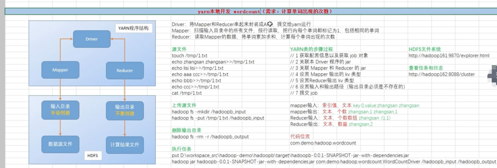
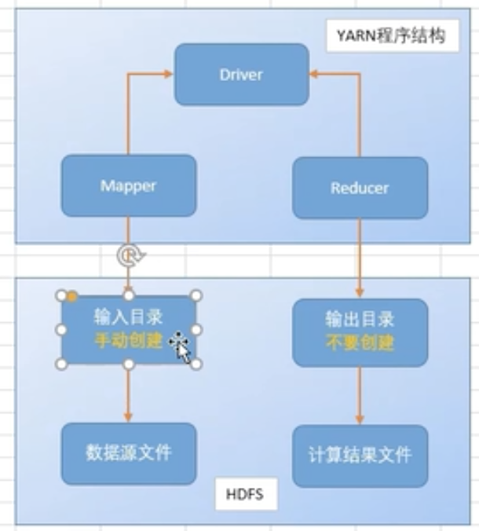
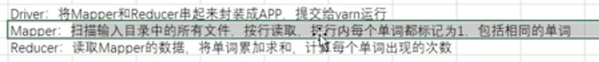
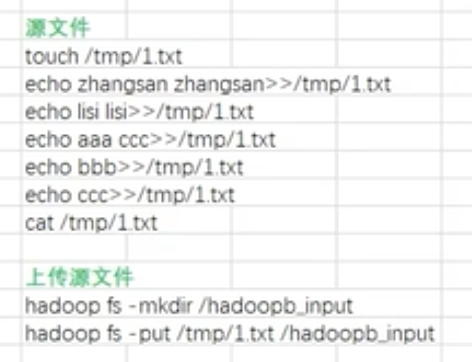
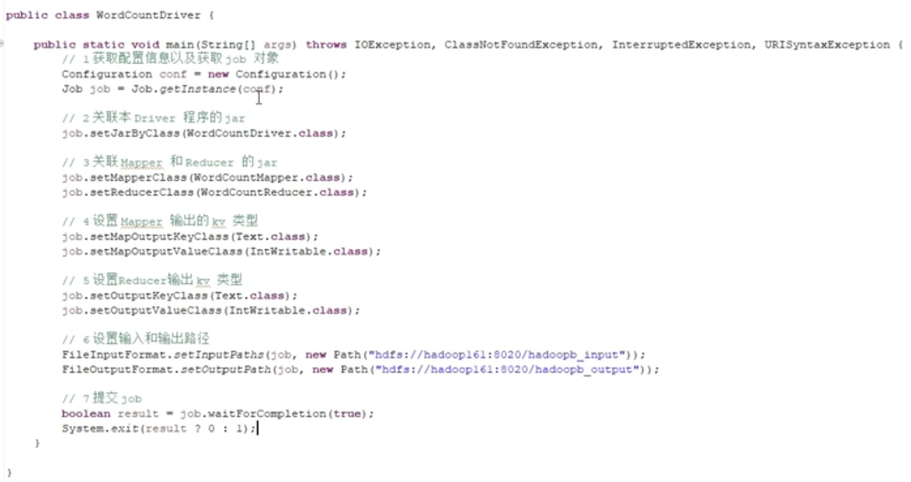
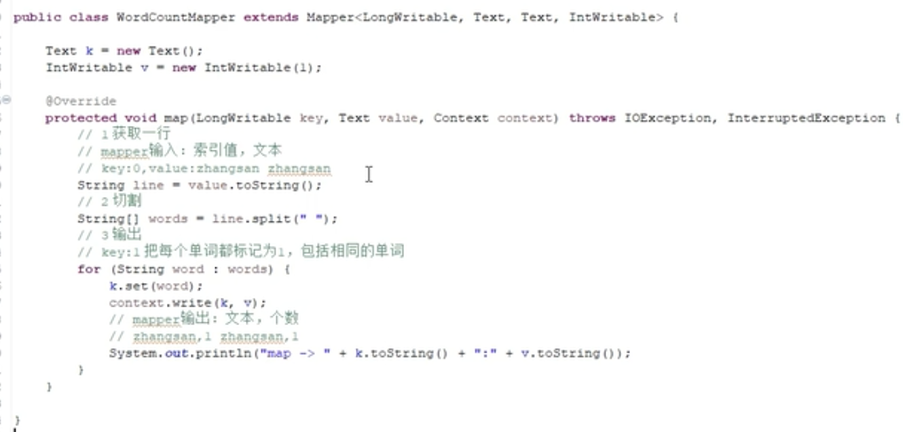
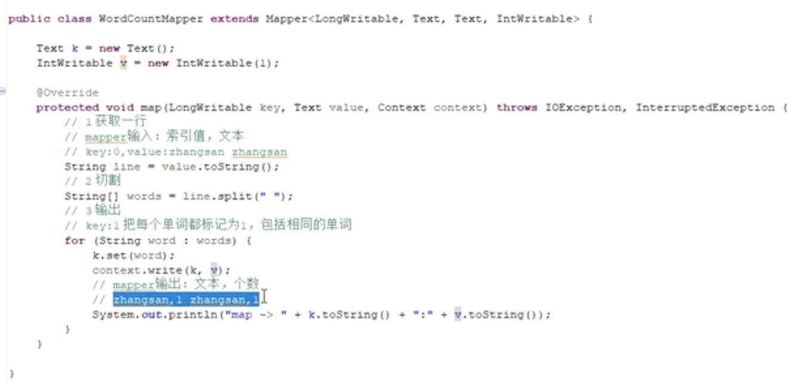
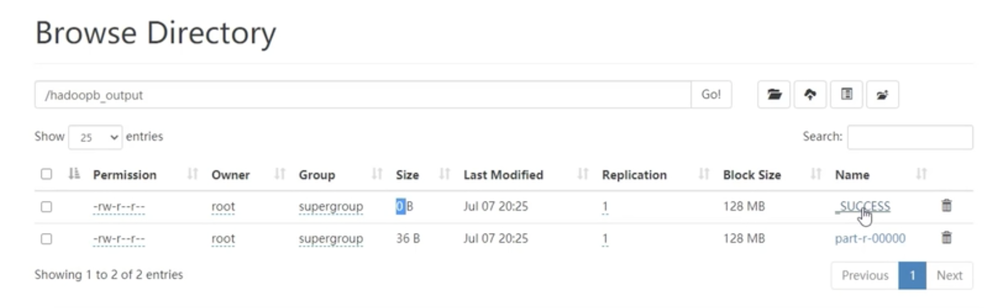
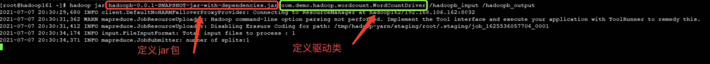
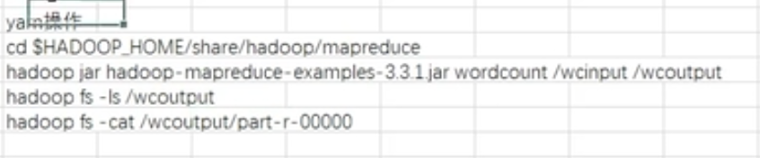

## hadoop-yarn本地开发
   主要内容如下:  
     
   
### 1.yarn程序运行环境的结构
  运行环境结构主要包括2部分:HDFS跟YARN程序结构；
    
   我们运行wordcount的时候，首先按照上面步骤：
   在hdfs里面手动创建文件夹。输出文件夹会自动创建，我们不需要管。 
   yarn的程序结构由Driver作为入口类。 我们需要配置Mapper跟Reducer这两个处理类。 
   处理过程是:Mapper处理类会先去源文件加中去寻找源文件，然后把这个源文件进行处理，
   处理完成之后Reducer会从Mapper这边拿数据，拿到数据之后Reducer会将这个数据再次处理
   一波，然后将数据输出到结果文件中。  
    
   
### 2.生成源文件
    
   我们创建文件/tmp/1.txt;然后将其拷贝到hdfs的目录下。
   
   

### 3.编写代码-本地运行
##### 1.Driver程序
   我们主要编写Mapper、Reducer跟Driver。 
     
   
##### 2.Mapper程序  
   Mapper程序如下:  扫描输入目录里面的很多文件，其中
     
   其中key是我们数据的位置，从0开始；value是某行的文本。
   
     
##### 3.Reducer程序    
  Reducer程序是从Mapper里面获取数据的，所以其
     
  
  程序运行完成之后，我们可以看到我们的结果文件会在hdfs里面输出：
        
  
   
### 4. 代码服务器上运行 
   然后我们定义我们的驱动类以及运行的jar；结果如下:
      
     
### 5. 官方提供的结果
   我们执行如下操作：
    
   
   后面发现跟我们的编制结果是一致的。  
   
   
    
   
     
   
