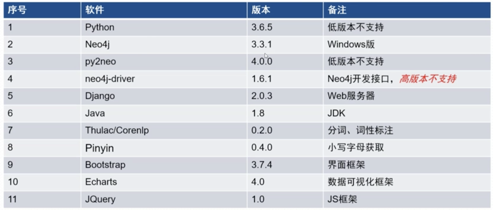
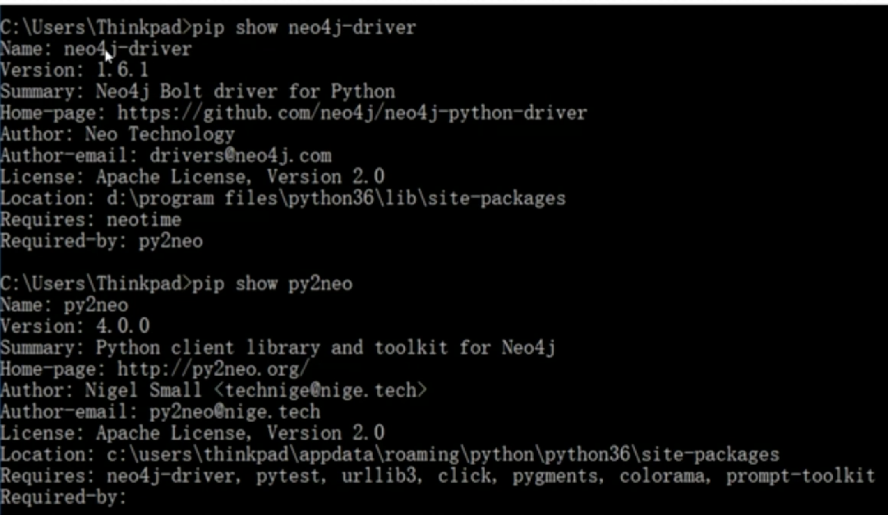

## 1、环境要求
    软件要求的版本最好看一下对应的版本要求。
neo4j是一个图数据库，可以类比成我们的mysql或者oracle这种关系型数据库。
py2neo是python版本的neo4j开发框架。neo4j有自己的驱动程序。neo4j-driver是neo4j的原生驱动。py2neo的4.0.0跟3.0.0有本质上的区别。  
我们也借鉴了其他的开发框架：
Django是我们的web服务器开发框架。  
分词、词性标注我们使用：Thulac或者Corenlp。

对应数据如下：

