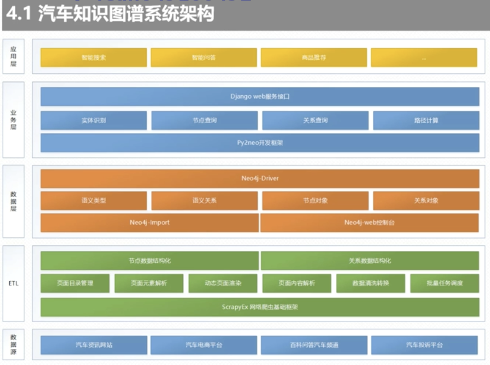
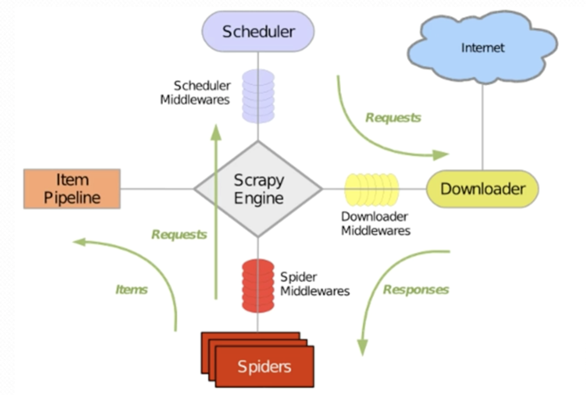
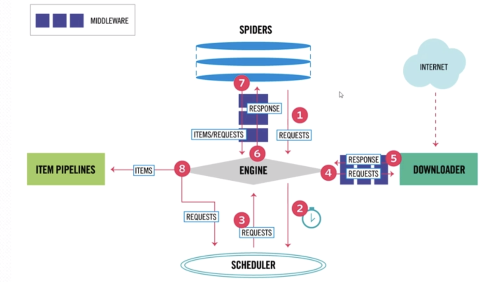
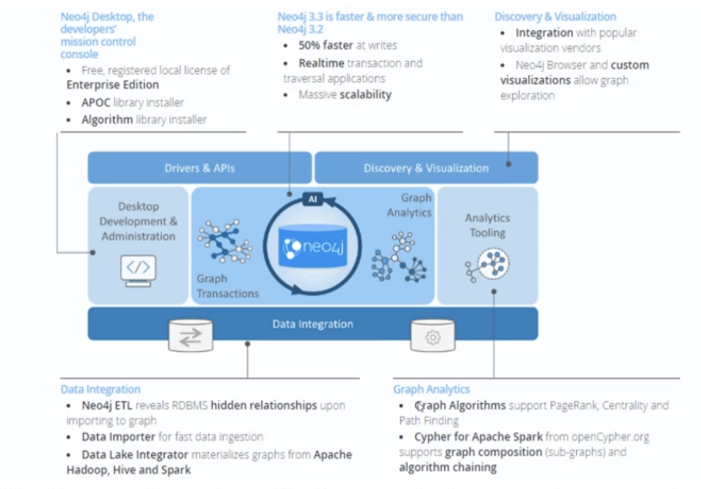
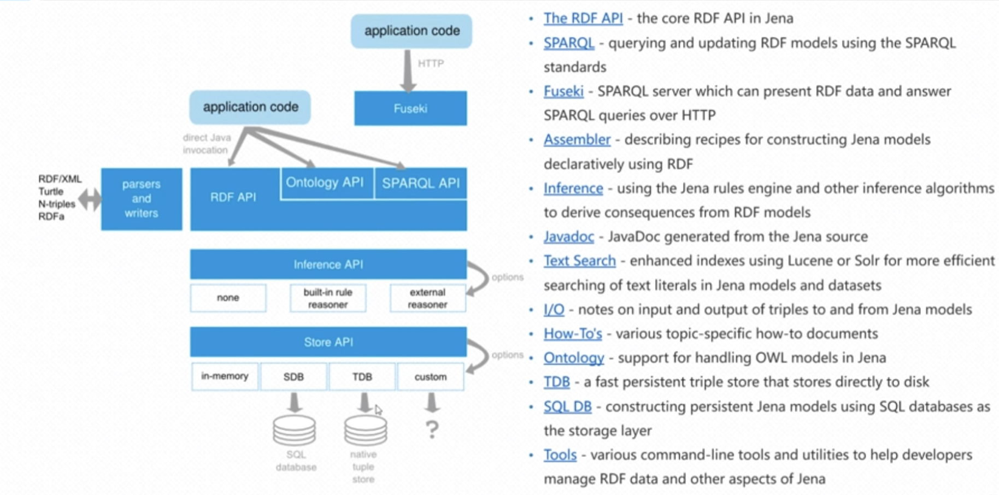
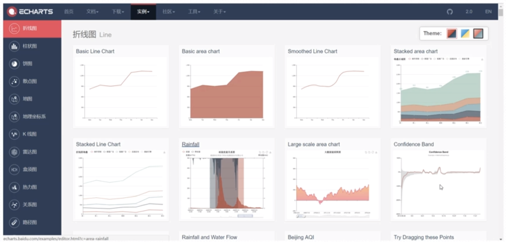

### 汽车领域的知识图谱系统架构
汽车领域的知识图谱系统架构如下：
  

### 1、基础架构
我们一般可以基于知识图谱做什么呢？  
###### 应用层
人工智能时候，人机交互已经发生了巨大变化，我们可以基于知识图谱做：智能应答:传统知识应答中，客户询问一句话，我们的机器会返回一系列结果，然后用户
根据这个结果做一些应答，但是针对于精准搜索而言：需要我们获取信息时候，需要精准的应答。  也可以做智能应答。

商品推荐：基于过往交易历史我们做一些知识推荐。比如我们的淘宝或者京东时候，都会进行数据推荐。就是基于商品的相关进行计算。  

###### 业务层
为了满足应用层的功能需要，我们需要什么业务或者技术支撑了？
web服务接口：基于Django的web服务接口。  
在这web接口之上我们提供：实体识别、节点查询、关系查询、路径计算。其底层是依赖于
Py2neo的开发框架。  

###### 数据层
数据层就是我们知识图谱存储的知识节点的层次。我们这里牵涉到了neo4j的数据导入。
neo4j-web控制台：进行输入指令可以导入数据。
但是有个问题：数据量过大的时候会出现数据导入异常。但是导入时候出错我们需要使用查看java内存情况。

####### ETL层
  我们有了业务层、数据层那么我们如何就绪这些数据呢？这个里面会涉及到：知识的抽取。这个模块会牵涉到
ScrapyEx的网络爬虫基础框架。Scrapy因为在我们的业务中是不满足我们的需求，所以我们需要进行一些
扩展:隐匿省份、动态渲染。  

###### 数据层  
  数据层，我们需要汽车相关的数据。     

### 2、汽车知识图谱数据源:优先级
  我们讲解知识图谱的时候，大部分人讲解的是：自然语言处理、⌚事件抽取、信息抽取等这些都是比较扯淡的做法。1、这些技术都不是很成熟，达不到生产上的应用。
2、这是一帮做科研的人需要做的东西。这些东西是我们的辅助，并不是我们的主要，所以我们在做知识图谱的时候，需要结构化的数据，所以就是我们的数据源优先策略。  
所以我们按照优先级，我们的知识图谱数据优先级排序如下：结构化数据（DB）优先级最高、半结构化数据(Web站点数据)、非结构化数据(Text文本数据)

### 3、知识图谱关键技术:网络爬虫

  
   爬虫里面有一个领域，那就是Scrapy。针对于Scrapy我们有两个点需要知道：
1、这个只是一个框架：不是一个具体的程序包。他是构建一个网络爬虫流程的全描述。包括：调度体系、pipeline管道、下载器、爬虫引擎、抓取器。
2、爬虫交互逻辑：
    
 爬虫原理如上：1）爬虫器发起网络请求：2）调度程序触发。3）调度程序之后会把处理转发给我们的处理引擎。4)：处理引擎会真实去访问我们的internet网络。
 5）：然后将我们的页面获取过来作为response返回 6）：引擎拿到数据之后交给我们的spiders 7)爬虫器:spiders会将我们的请求交给我们的管道进行数据处理
 8）：在管道里面完成数据的格式化。
 
### 4、知识图谱关键技术:图数据库

##### 4.1 第一个技术路线:neo4j
   
 neo4j对于哪些技术能力一般，没有很深的技术能力的团队。其有完整的技术体系：批量导入/导出等。
中间层：从上图空间我们知道，neo4j提供了右边的专门的分析工具 以及左边的桌面开发者工具。
最上面层：提供类似于mysql的开发接口。
最下面层：提供了我们的饿数据集成。

##### 4.2 第二个技术路线：
  没有完备的只是文档。但是其工具很强。
   
 
### 5、数据可视化
   
 另外一个数据可视化：一般有2个选型，一个是D3一个是echarts
