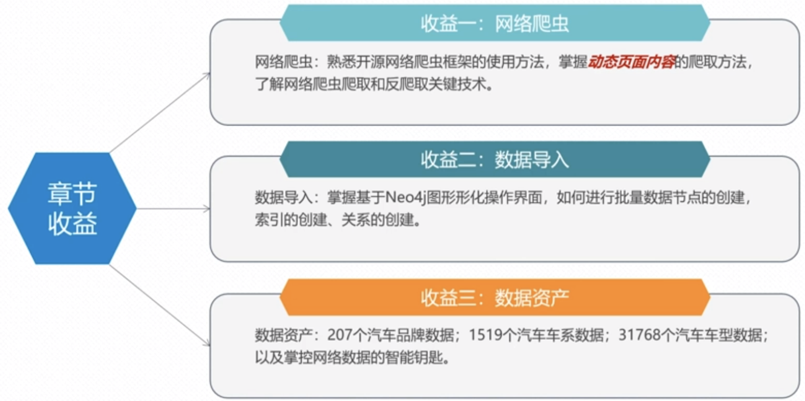
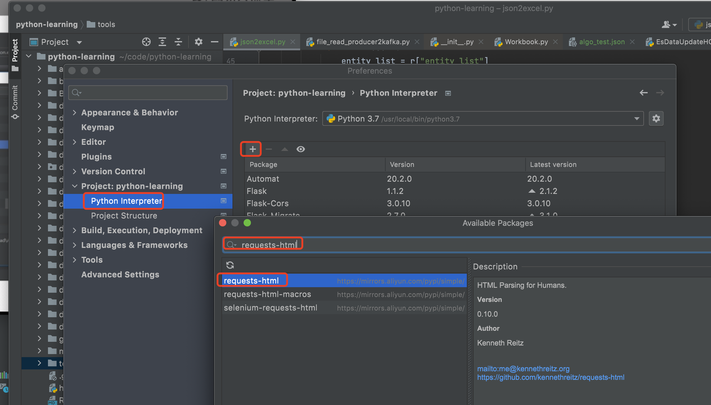

### 开发环境安装跟部署
   汽车知识内容的获取，我们从下面4个方面进行讲解。
   01-开发环境安装部署
   02-汽车品牌数据获取
   03-汽车车系数据获取
   04-汽车数据批量导入
   
   首先,我们需要把汽车270个汽车品牌的数据爬取下来并且把汽车车系的数据也获取下来：品牌、系列等。然后我们将我们爬取的汽车品牌数据跟汽车车系数据，我们需要将在和谐数据导入到我们的
图数据库里面来。 这个时候涉及到节点创建跟关系创建。通过这一讲解我们可以学习到如下知识：
    
  
   
#### 01-开发环境安装部署
  网络数据爬取我们使用的是request-html，所以我们首先需要安装这个包:
  方式一:如下
    
  
  方式二:
  ```renderscript
   pip install requests-html
  ```

   其中requests-html如下:
   
```renderscript
https://github.com/psf/requests-html
```
  

#### 02-汽车品牌数据获取
  
   
#### 03-汽车车系数据获取

#### 04-汽车数据批量导入
