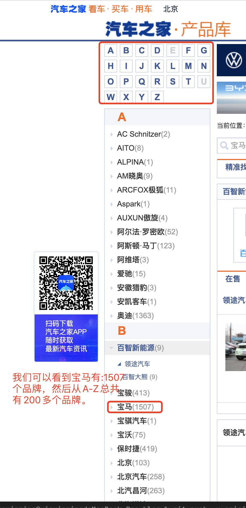
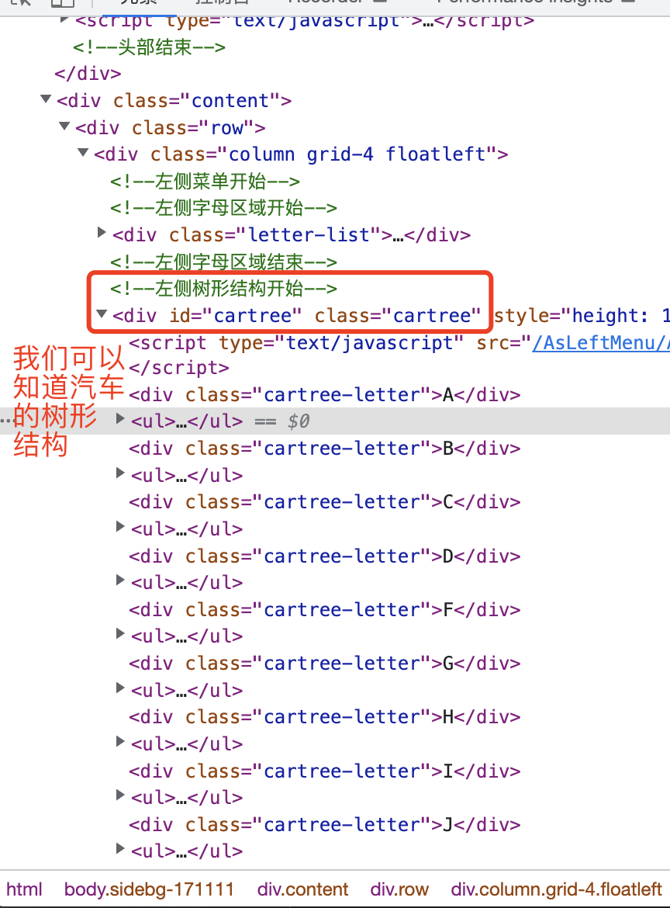
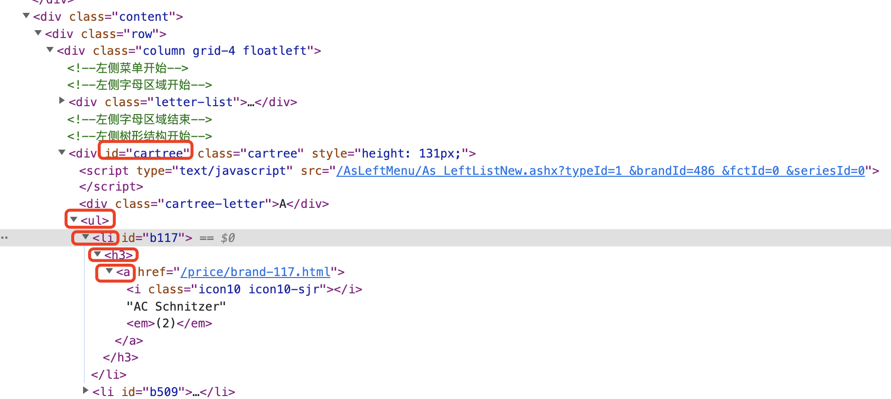
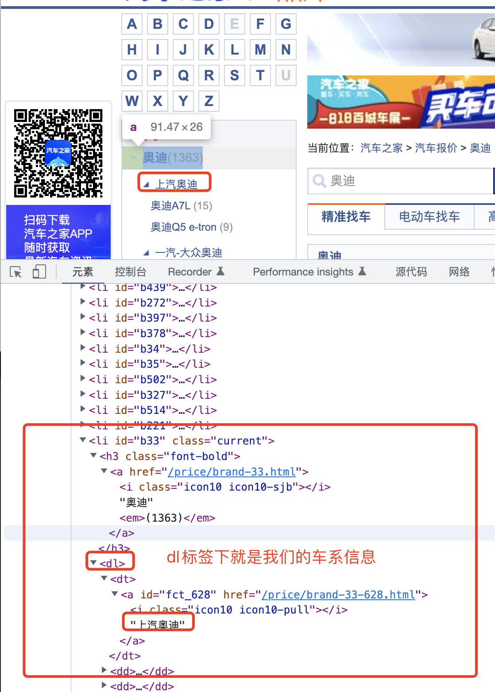

### 开发环境安装跟部署
   汽车知识内容的获取，我们从下面4个方面进行讲解。
   01-开发环境安装部署
   02-汽车品牌数据获取
   03-汽车车系数据获取
   04-汽车数据批量导入
   
   首先,我们需要把汽车270个汽车品牌的数据爬取下来并且把汽车车系的数据也获取下来：品牌、系列等。然后我们将我们爬取的汽车品牌数据跟汽车车系数据，我们需要将在和谐数据导入到我们的
图数据库里面来。 这个时候涉及到节点创建跟关系创建。通过这一讲解我们可以学习到如下知识：
    
  
   
#### 01-开发环境安装部署
  网络数据爬取我们使用的是request-html，所以我们首先需要安装这个包:
  方式一:如下
    
  
  方式二:
  ```renderscript
   pip install requests-html
  ```

   其中requests-html如下:
   
```renderscript
https://github.com/psf/requests-html
```
  

#### 02-汽车品牌数据获取
  我们需要获取汽车品牌数据，主要包括3快：1）:页面元素分析 2）品牌数据爬取(指代汽车品牌)  3）数据结构处理(数据本地化存储导入到数据库)

##### 1）:页面元素分析
  页面元素分析我们可以从汽车之家中获取到数据。  
https://www.autohome.com.cn/beijing/
  我们可以看到汽车之家中的数据目录里面的：报价-https://car.autohome.com.cn/price/series-3554.html#pvareaid=3311277
   
   我们可以看到浏览器开发者工具，我们可以知道：其菜单的结构
      
   
##### 2）品牌数据获取

品牌信息获取代码如下:

```renderscript
# 汽车品牌
def get_url():
    current_dir = os.path.abspath('.')
    print(current_dir)
    file_name = os.path.join(current_dir, "data\\bank.csv")
    print(file_name)
    with open(file_name, 'wt', newline='') as csvfile1:
        header = ['bank', 'count', 'url']
        writer = csv.writer(csvfile1)
        writer.writerow(header)
        # 访问页面
        response = session.get(url)
        response.html.render()
        # 查找元素
        banks = response.html.find('.cartree ul li h3 a')
        # 
        for bank in banks:
            # print(bank.text)
            # 格式化
            bk = bank.text
            start = bk.find("(")
            end = bk.find(")")
            bank1 = bk[0:start]
            Num = bk[(start + 1):end]
            url2 = url + bank.attrs.get("href", None)
            print(url2)
            save2csc(writer, bank1, Num, url2)
        # print(banks)
    csvfile1.close()
```

上面代码我们是根据以下关系页面进行数据获取：
  

#### 03-汽车车系数据获取
  与汽车品牌数据获取类似，我们这一章节讲解3部分内容:1）:页面元素分析 2）车系数据爬取(指代汽车品牌下面的车系的,比如：安迪A3、奥迪A7)  3）数据规范化处理(数据本地化存储导入到数据库)
##### 1）:页面元素分析
  首先我们的汽车品牌信息的获取是按照如下的一个标签页面内容：
  

```renderscript
# 车系数据获取
def get_bank():
    current_dir = os.path.abspath('.')
    print(current_dir)
    file_name1 = os.path.join(current_dir, "data\\type.csv")
    file_name2 = os.path.join(current_dir, "data\\bank.csv")
    #
    with open(file_name1, 'wt', newline='') as csvfile1:
        # header = ['bank','Type','Count']
        writer = csv.writer(csvfile1)
        # writer.writerow(header)
        # 读取并获得所有URL地址，同时记录品牌名称
        with open(file_name2, 'r') as csvfile2:
            reader = csv.reader(csvfile2)
            for row in reader:
                # 随机浏览器 User-Agent
                headers = {"User-Agent": random.choice(USER_AGENTS)}
                session = HTMLSession()

                # 01:读取整行
                column1 = row[0]  # 读取第1列
                column3 = row[2]  # 读取第2列
                # 逐个URL进行爬取
                response = session.get(column3, headers=headers)
                response.html.render()
                print("URL=", column3)

                banks = response.html.find('.cartree ul li dd a')
                for bank in banks:
                    bk = bank.text
                    # 逆序查找：车系，从右查找
                    start = bk.rfind("(")
                    end = bk.rfind(")")
                    bank1 = bk[0:start]
                    Num = bk[(start + 1):end]

                    url2 = urlroot + bank.attrs.get("href", None)
                    print(column1 + " " + bank1 + " " + Num, url2)
    
                    # 获取到的bank1需要右边去除空格:rstrip()
                    save2csv(writer, column1, bank1.rstrip(), Num, url2)
                    csvfile1.flush()
                print(banks)
                time.sleep(1)
```
  

#### 04-汽车数据批量导入
