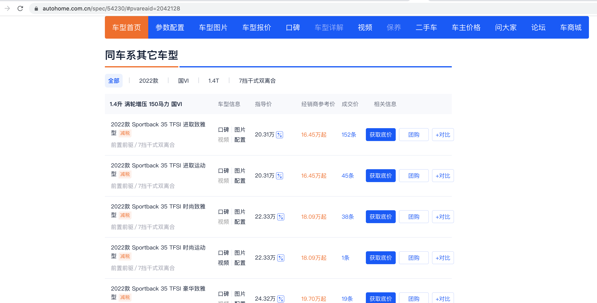
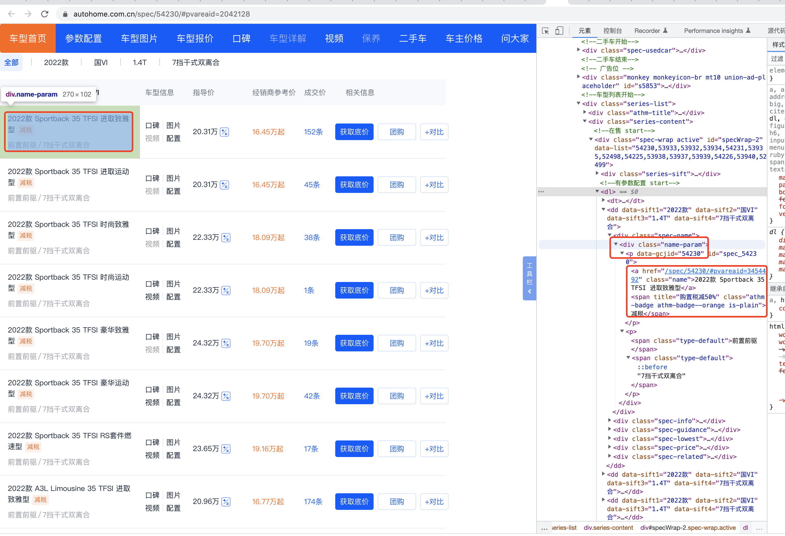
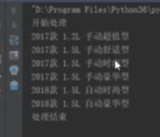

###  汽车车型数据获取
  本节我们主要讲解:基于车系，获取车型信息。  
之前我们讲解了基于"汽车之家"我们如何获取汽车的品牌以及如何获取汽车的车系。 现在我们具体研究如何获取车型。  
 比如：我们的宝马-X3这个知识汽车的系列。
 
    
  从上面我们可以知道:我们的车型有很多种类：我们可以直接获取的信息是：车型、指导价、经销商报价等。  
  
  我们通过查看源码信息可以知道：其对应的div类型是:
    
  
  然后我们看一下我们的程序设计：  
      
  我们可以看到对应获取的标签是:.spec-wrap dl dd div.spec-name p a
打印后输出的对应的结果为:
  

  
   
