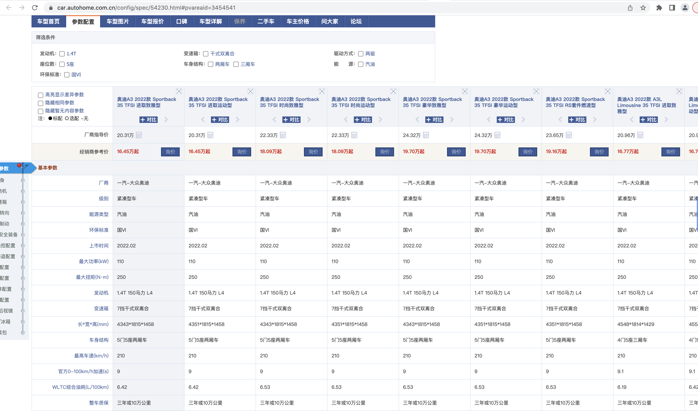
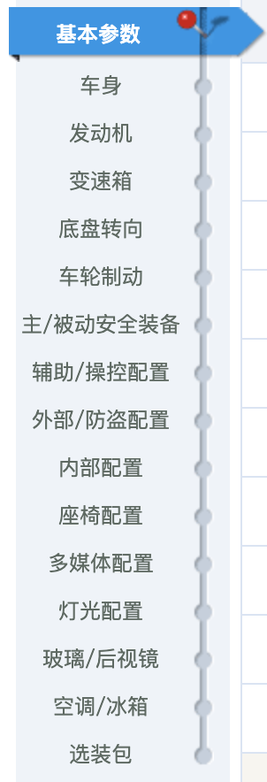
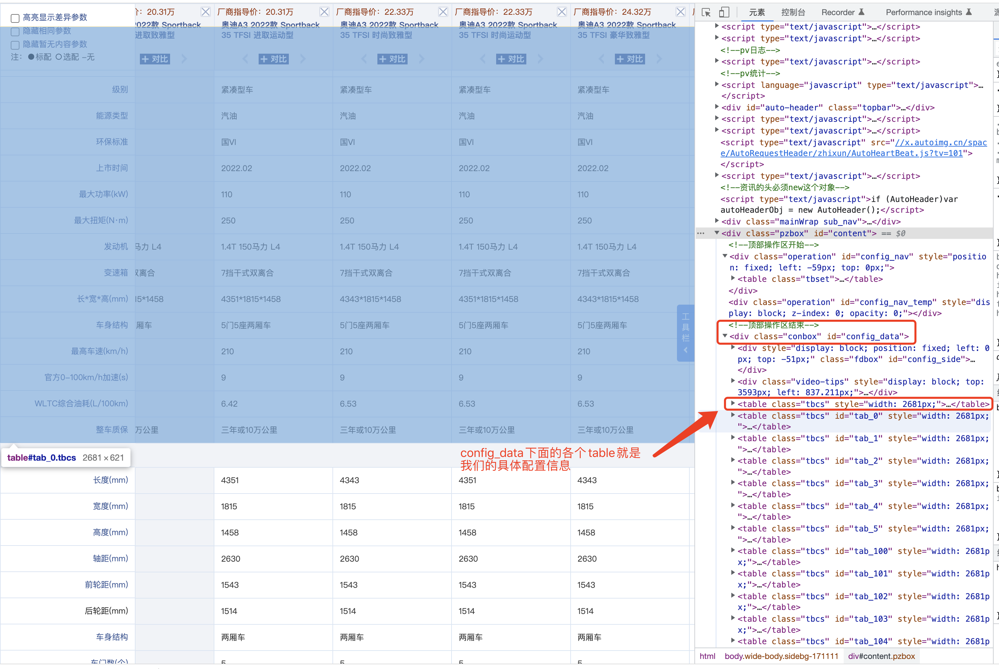
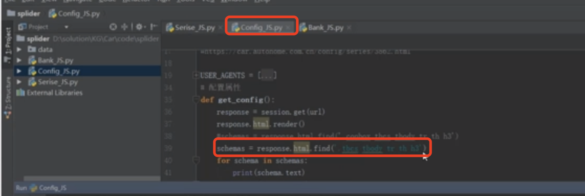
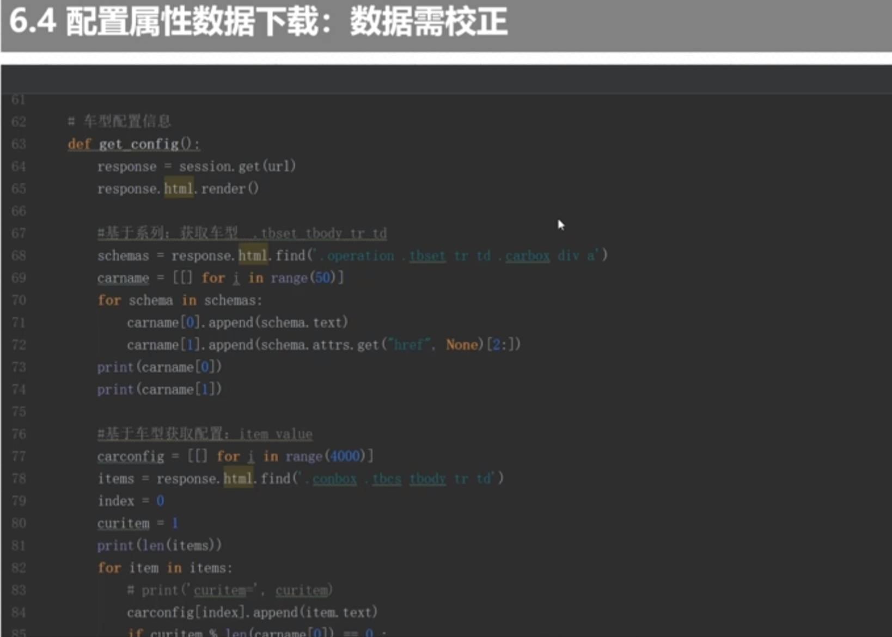

###  汽车配置信息获取
  之前我们讲解了关于汽车：品牌、车系、车型数据获取。现在我们讲解具体每一款车型的具体配置的数据。
  本节我们主要讲解:数据结构、属性配置数据获取。  

#### 1.页面结构分析跟下载
  我们看下具体的页面信息如下：  
    
  这里面的配置信息涵盖了几部分，他会把同一车系下的信息：车型信息、车系配置的基本参数
    
  
  我们通过浏览器开发工具查看我们的页面元素：
      
    
   接下来我们就是把里面的各个值下载下来，然后进行数据的填充。  
   程序设计：
      
   我们首先看到了程序下载的路径，然后根据这个路径我们进行文件的下载。然后遍历里面的元素全部下载下来。  
   
#### 2.属性数据的下载
    
   然后我们可以看到这些数据信息。我们通过爬虫能把大部分数据获取到，但是由于反扒原因，所以有时候有些信息需要人工去进行处理标记。 
   
   
      
  

  
   
