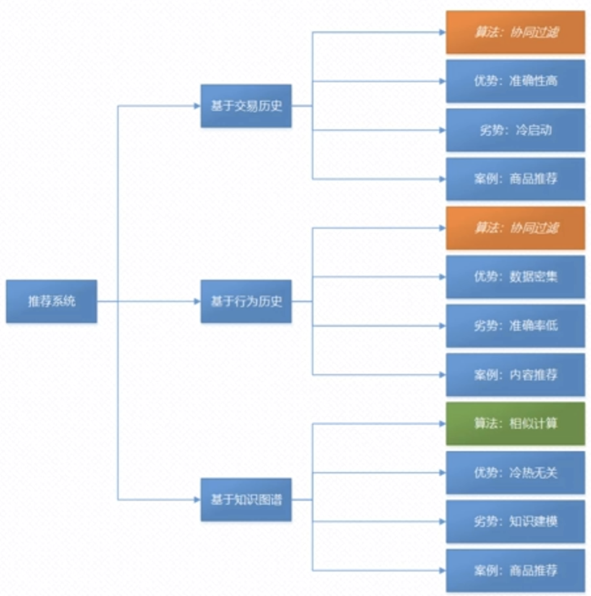
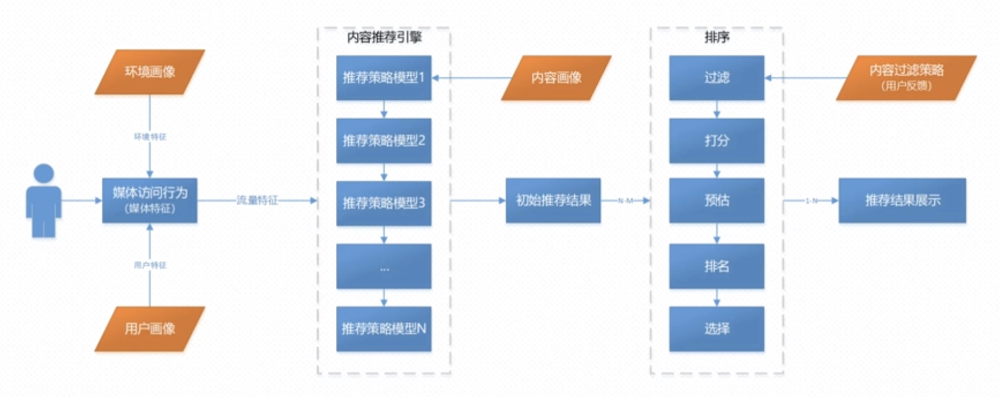
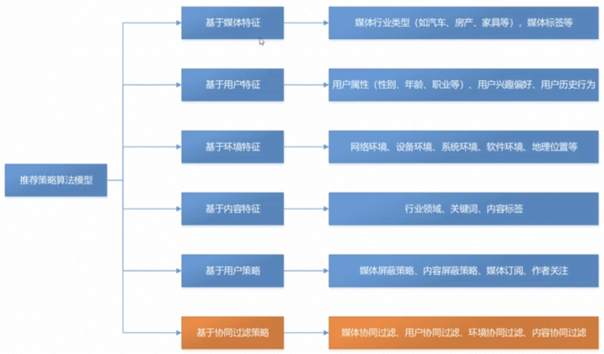

###  推荐系统基本原理和机制  
   推荐系统我们主要讲解以下3个方面:  
   1、基于交易历史
   2、基于行为轨迹
   3、基于知识图谱  
   
#### 1、常见推荐系统的类型划分
 
常见推荐系统的类型为以下3个方面：

基于交易历史：
  最经典的推荐系统做法，核心算法就是:协同过滤(主要是基于我们概率论里面的公式:当A发生的时候的概率依赖于当A跟B同时发生的概率)，这种算法的优势
是:准确率非常之高(因为人对商品的需求有关联性,并且有依赖性)  劣势:我们讲解协同过滤的时候是依赖于大数据,如果你是一家新鲜的企业,不是京东或者其他电商系统,或者
你没有保存真实的客户数据的话,这个时候如果你的系统想基于客户的行为推荐商品的话，这个时候会面临冷启动的问题。所以项目的成熟方案是基于商品的行为历史去做推荐。最
典型的是基于搜索引擎的商业广告。  

基于行为历史：
   核心算法就是:协同过滤，优势是：数据密集(把用户的所有访问历史收集起来) 劣势:用户数据非常大, 常见的案例是:内容推荐(比如:今日头条、抖音会基于客户的历史做一些推荐)。

基于知识图谱:
   基于知识图谱的算法是2者的联合；比如基于交易历史的数据的话，它的数据量比较小的情况下，如何做呢？这个时间我们可以基于我们的相似计算算法。
   但是知识图谱的优势是：冷热无关，意思就是我只需要掌握数据的部分信息就可以通过相似计算的模式找到我们感兴趣的内容。劣势：知识图谱，尤其是在垂直领域 其有很强
   的知识依赖性。(依赖的是知识建模) 现在很多企业都在构建垂直领域的知识图谱--尤其是在搜索引擎、商业广告这部分。

#### 2、推荐系统的体系结构

  
  上面是推荐系统的一个交互流程图，我们可以看到:
  当用户访问页面的时候，会形成一个"媒体访问行为"，这个时候会带来2个特征：1、环境特征：比如我现在使用的是app，比如我现在手机的型号是：小米MAX2；手机的环境是wifi;
这个时候也会通过环境特征、或者通过用户的登陆信息:用户id 然后获取到 "用户画像"。环境特征、媒体访问行为、用户画像3者加和形成一个流量特征。这个流量特征就是我们推荐引擎
的输入。内容推荐引擎的后面一部分其实都是属于我们的推荐引擎。然后我们基于各个推荐策略加上我们内容的画像，然后形成一个最初始的推荐结果。基于这个初始推荐结果然后我们进行
排序(过滤->打分->预估->排名->选择) 这个是推荐系统的整体结果。

#### 3、推荐系统的策略模型
  常见推荐系统的策略模型有:
 
  比如基于推荐策略算法模型，会得到以下特征:
  基于媒体特征：基于自媒体的、维护各种头条号的。
  基于协同过滤策略：指代用户曾经访问过什么？以及基于访问的信息做的一些行为。有对媒体/用户/环境/内容的协同过滤。  
  
  
  
  比如我们基于关键词的匹配的搜索。  
  
  比如我们搜索：手工毛衣，我们右边有广告其实就是基于关键词匹配的推荐。

 
如上的猜你喜欢就是纯推荐的内容了。

  
