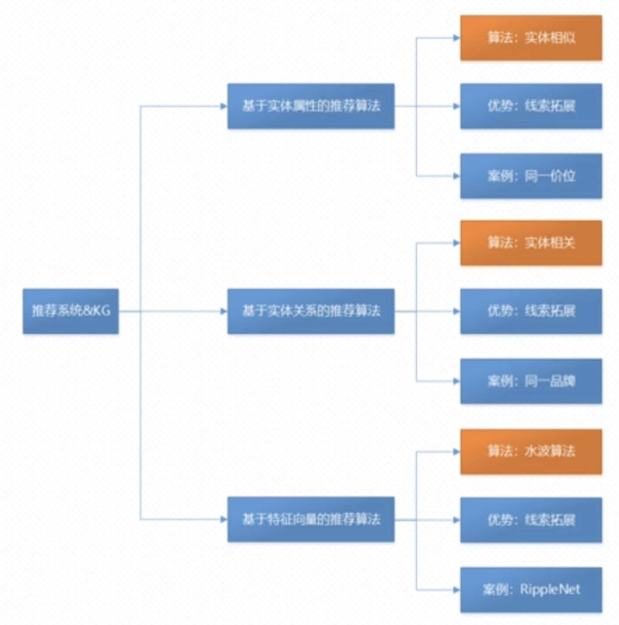
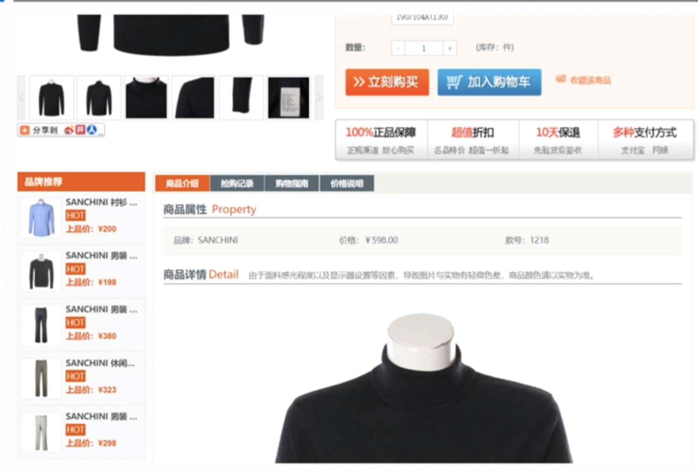
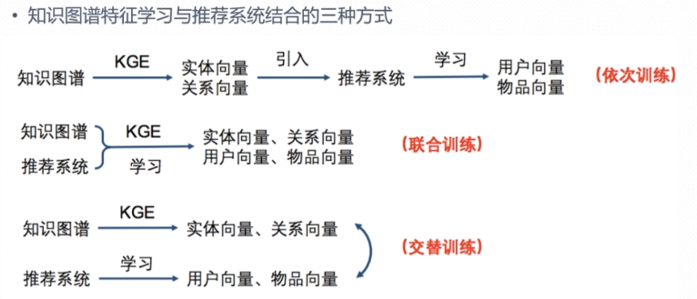

###  融合知识图谱的推荐系统  
   我们主要讲解:知识图谱与推荐系统融合的方式与案例。  

#### 1、推荐系统与知识图谱结合的三种方式

基于实体属性的推荐算法：算法模型采用的是：实体相似。  优势:线索拓展  案例:同类型商品推荐的时候，基本都基于同一价位。
基于实体关系的推荐算法：算法模型采用的是：实体相关：宝马-x3是车系。  这个系列下面与之相关的可能是宝马-x1。
基于特征向量的推荐算法：算法模型采用的是：水波算法。  
 
#### 2、基于实体属性的推荐算法
  比如如下推荐就是我们常用的知识图谱的数据推荐:

#### 3、知识图谱特征学习与推荐系统结合方式  

 主要是3种方式:
 依次训练:知识图谱->KGE(嵌入式表示)->形成实体向量/关系向量->同时引入推荐系统->然后进行学习->学习出来用户向量 物品向量
 联合训练:
 交替训练:
