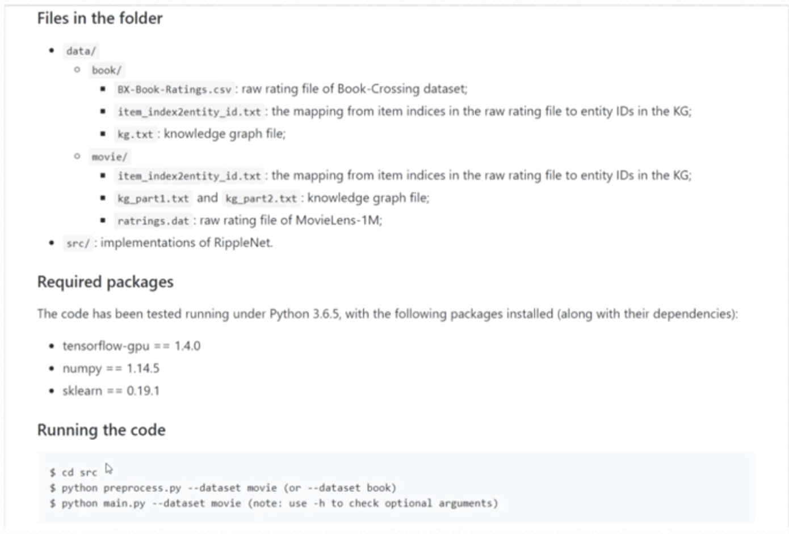
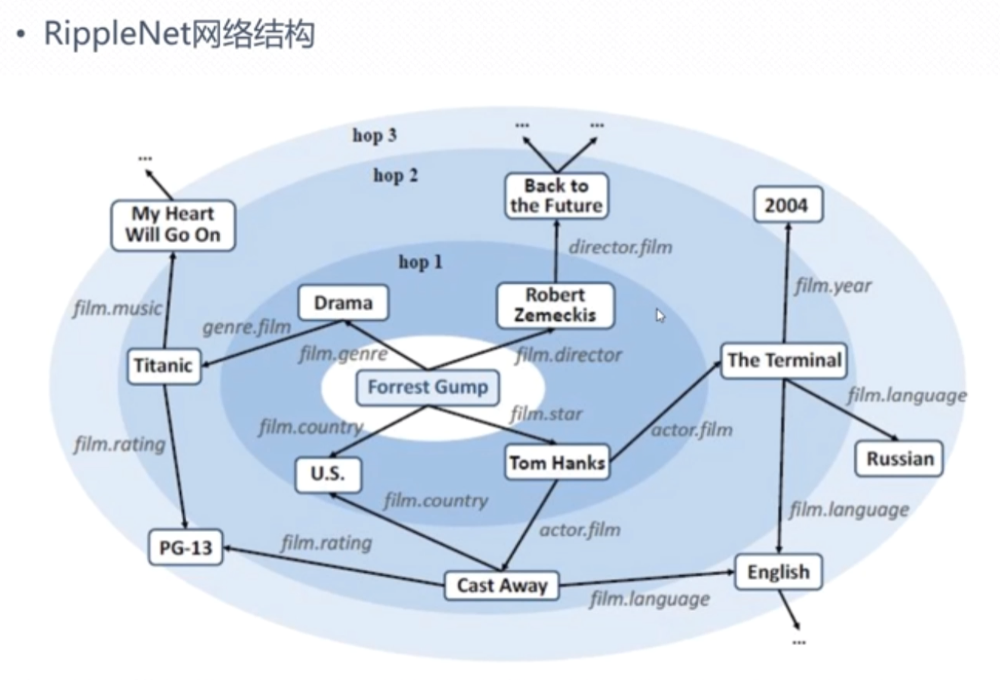
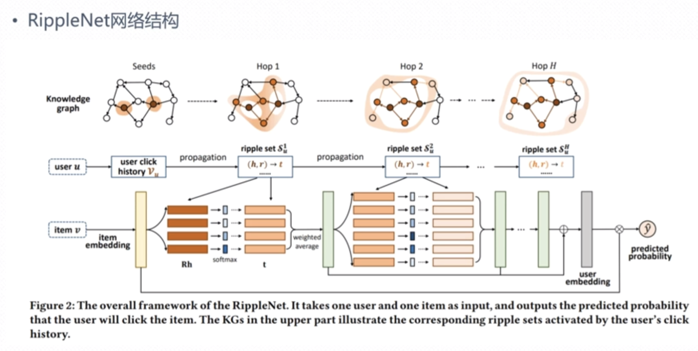
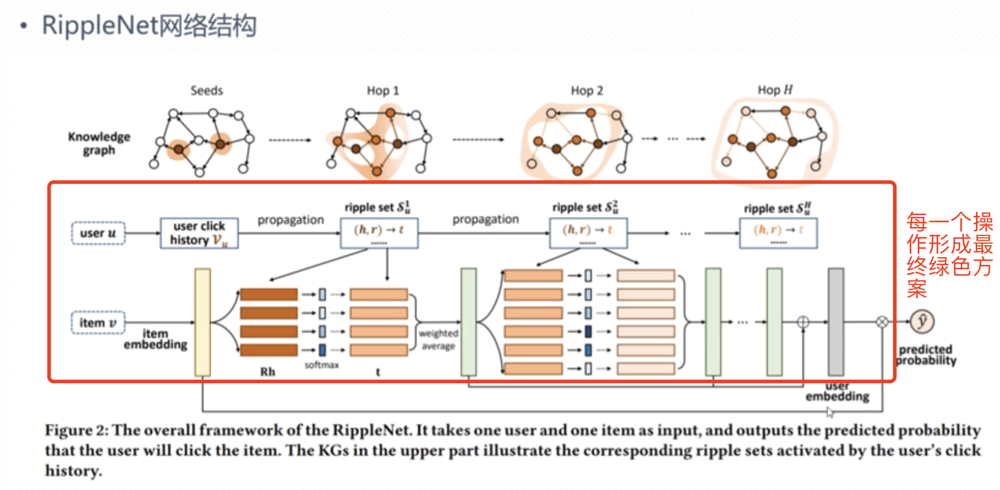
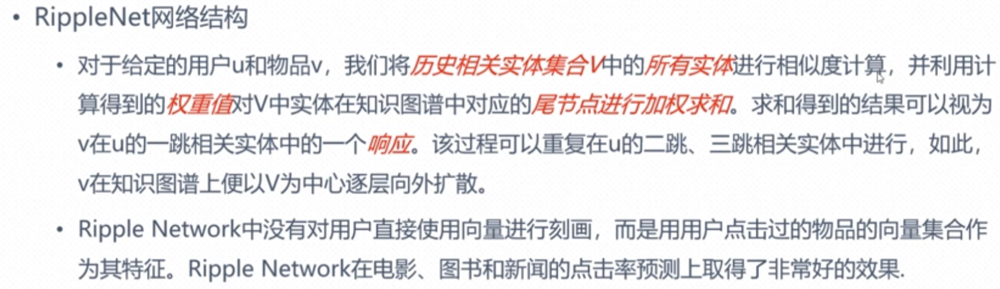
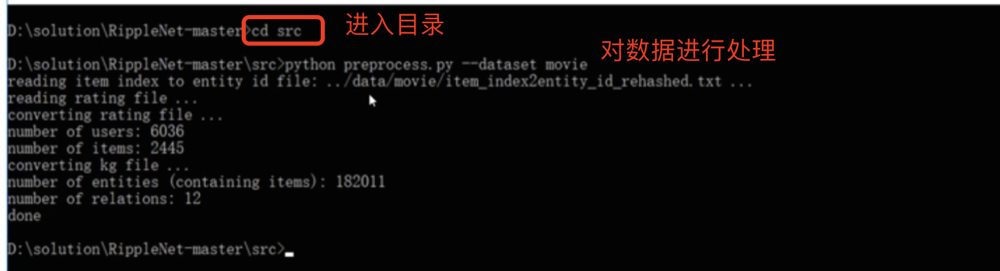
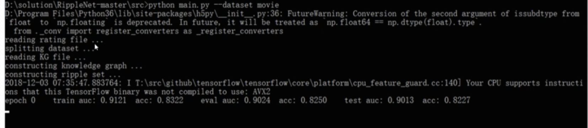

### 基于KGE的开源推荐系统框架  
  这一部分给大家讲解推荐系统，基于KGE,KGE是什么呢？跟word词向量一样，对于知识图谱也一样,他也有基于知识图谱的向量表示，
所以我们这一节也可以叫做：基于知识图谱特征表示的开源推荐框架。我们选择的是:RippleNet-基于联合学习的。 
RippleNet基于KGE的推荐框架工作原理和实现机制。
  RippleNet的数据结构如下:

#### 1、代码结构

data下是我们的数据：
  book-是我们的书本数据
  movie-是电影数据
  
需要的依赖有:
  tensorflow-gpu
  numpy  
  skleam  
  
运行代码:  
  进入src下进行程序执行
  
#### 2、RippleNet的主要流程 
  
  RippleNet的工作原理和实现机制如上:
1、当用户对某一个影片有浏览行为之后：图上的Forrest Gump，当用户想要获取其电影的兴趣爱好时候
2、以此用户点击的影片为中心：Forrest Gump；通过去寻找其主演：Tom Hanks，并且Tom Hanks也出演了电影:
The Terminal；其导演是:film.director是:Robert Zemeckis 其又是导演了:Back to the Future,
其隶属的国家是:U.S；  

总结：所以我们的推荐是基于:基于用户已经访问的实体节点+实体节点与外部关系来进行的相关性计算。

#### 3、RippleNet工作原理和实现机制  
   

  从上面的图我们可以知道，这个知识图谱其实有3部分；第一部分:是知识:(Knowledge grap)  第二部分:用户(user)  第三部分:item-用户所关注的对象
这张图我们如何来解读呢？我们抛开所有的其他内容，我们先看一下我们的数据的输入跟输出。我们可以看到数据的输入是:
   userid--用户id,我到底是谁
   item--物品,这个物品可以是电影,也可以是图书
   这个时候我需要计算用户跟物品的相似度(相关度)，这个时候就牵涉到了第三个输入:知识图谱(Knowledge grap),知识图谱是物品实体与实体之间的关系；所以这里面的
实体就与我们知识图谱里面的节点(Seeds、Hop1、Hop2、...、Hop H)对应。
  针对于用户我们需要做一系列的计划，也就是图中一连串的操作，最终形成我们图中绿色的输出。最终形成用户的向量表示。  
  

  
  item--实体输入的时候,会形成一个实体向量(item embedding)跟用户向量(user embedding)之间做相似计算(相关性计算);最后形成一个可能的输出(predicted probablity)  
其点击过的历史就是我们之前的种子(seeds);点击hop 1就代表的是一跳--指代扩散1次。扩散的数据集我们用ripple来表示。(h,r) 
  

 
#### 4、RippleNet运行
进行计算

进行训练  
  

  

