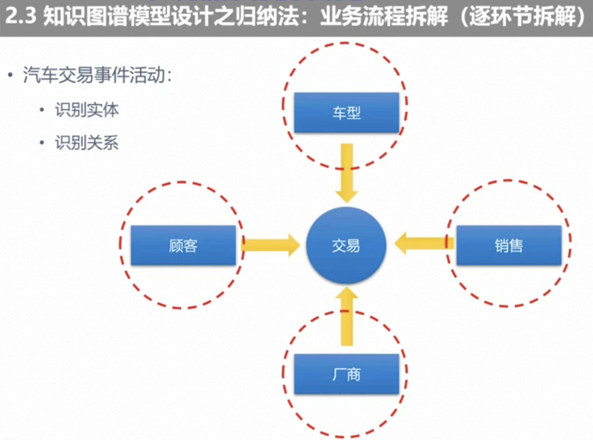

### 1. 知识图谱模型设计方法
概括总结：参照与对标，适配和裁剪；归纳与总结，抽象和提炼；

参考与对标：参照对标我们的行业标准。

适配和裁剪：基于自己的业务现状与业务场景适配，然后裁剪出我们的标准模型。

归纳与总结：有时候我们得到的数据是没有行业标准的，这个时候我们如何做呢？只能我们自顶而上进行归纳总结。
抽象和提炼：最后我们抽象跟提炼出内容。

#### 1.1 知识图谱模型设计方法论

     
  我们常用的方法有4种：专家法、参照法、归纳法、混合法。对应的方法是如上图所示。依赖条件为：
  专家法(领域专家) 参照法(行业标准) 归纳法(技术专家) 混合法(参考标准)  
  
注意的原则：方法选择原则是基于你的业务团队。围绕业务规划产品。

我们一般使用：混合法；采取自上而下 自下而上 居中调整的方法，这个是一般的靠谱的方法。  
条件是：有具体的参考标准。
##### 1.1.1  参照法
  

把上面的实体连接起来之后会形成如上的语义结构。  
上面生物有解剖结构，解剖结构是生物的一部分。解剖结构又有：胚胎结构、解剖异常。并且完全成型的解剖结构又是包含：
器官、组织、细胞等。

    
  我们的语义类型又详细分为以上类型。
  首先分为线索：线索又分为：实体跟事件；实体又分为：概念实体跟物理实体。事件又分为：现象跟过程以及活动以及一系列的划分。
  

##### 1.1.2  归纳法
   
 我们在实际生产中并不会直接按照上面来做，而是会切入到我们的一个点：比如我们的生产、销售这个环节的点。然后我们从横向跟
 纵向打通，最后管理我们的服务。我们整个汽车知识图谱构建也就是基于我们的销售跟服务环节进行的知识图谱的数据构建。
 我们现在拆解成一个单一的流程进行分析：销售流程。销售流程中只关注交易的过程（汽车交易事件活动）来进行：识别实体跟识别关系。
   
  
 从上图我们可以知道：交易涉及到的交易方式有：顾客跟销售。交易的标志物品是什么呢？车型跟厂商。所以我们简单拆解的话就会有4个实体对象。
 顾客、销售、车型、厂商。当然还有其他的，比如涉及到的保险等。
  
  
  我们上面讲解了我们知识图谱的构建方法，下面我们来讲解下知识图谱的构建流程。
### 2.知识图谱模型涉及流程
   
  
  流程：
  首先：语义类型的设计。
  其次：语义关系的设计。
  第三：实体对象的设计。
  第四：实体属性设计。
  第五：实体对象抽取。 
  
  两大技术体系；
  neo4j跟apache的owl。其对应关系如上图所示。
  
  很多人把：语义类型设计跟语义关系设计叫做关系抽取。到底是语义关系的设计跟关系抽取到底哪一个在前面呢？类比于我们
  数据库的设计，我们是先往表里面插入字段呢？还是先插入内容呢？同样的语义关系的设计要在关系抽取的之前。有了语义关系的
  设计才知道有多少种语义关系。
  
  
 
 
  
  
