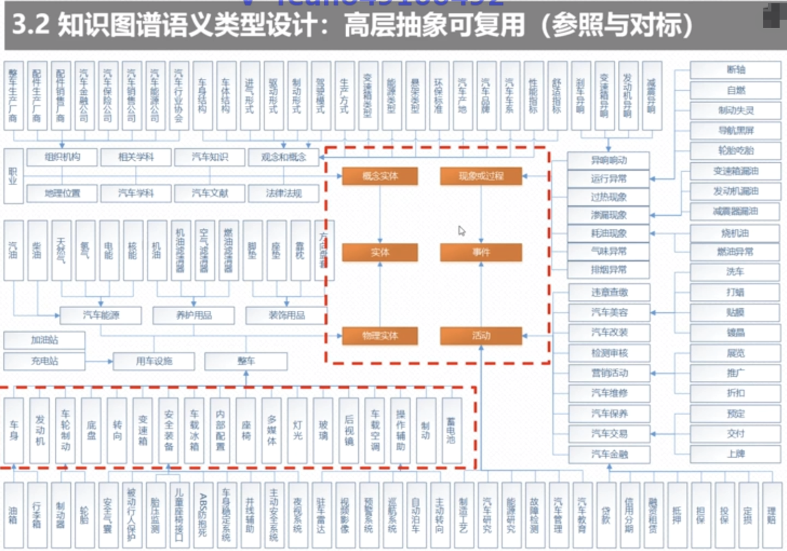
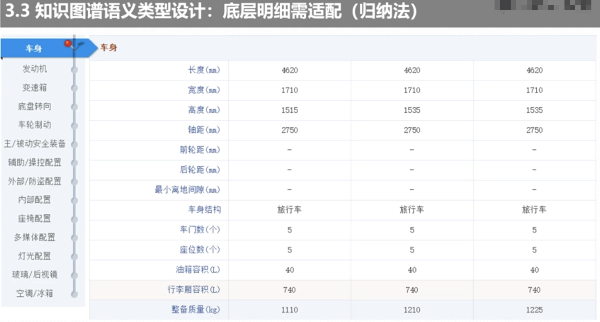
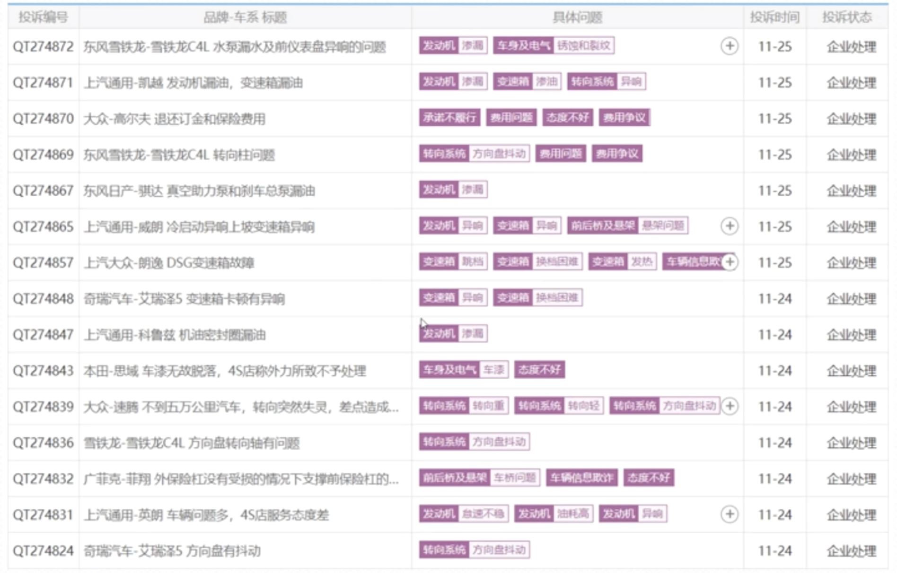
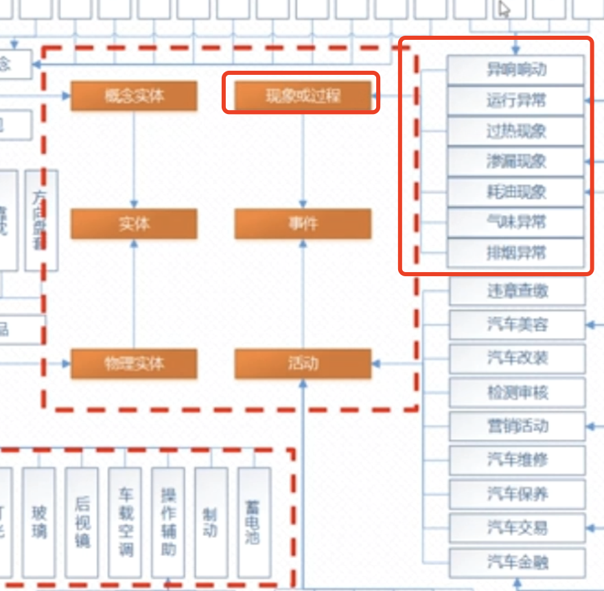

上一节我们讲解了知识图谱模型创建的方法论，今天的话我们主要讲解如何设计知识图谱的语义类型。  
我们还是基于我们现有的口诀：参照与对标，适配和裁剪；归纳与总结，抽象和提炼。  

### 1.知识图谱语义类型设计:高层抽象可复用(参考与对标)
   
  高层抽象可复用(参考与对标)是指ULMS他把万事万物分成了性词：事物。  
事物下面是实体跟事件。事件又分成了：活动跟现象或过程。 实体下面是：概念实体跟物理实体。
###### 1.1 概念实体跟物理实体差异
概念实体跟物理实体也比较好理解，比如：这是一个细胞：这就是一个物理实体(看得见、摸得着的东西)
概念实体就不一样：比如有一个卫生保障组织:他是一个概念实体。

###### 1.2 事件中:活动、现象或过程的差异
   现象或过程是指：我出现了/但是不一定是或者一定不是 主动的行为；比如张三感冒了，这是一个现象，触发方只有一个人:张三。
   活动：疾病医药活动：涉及到疾病诊断-医生通过医疗设备观察病人情况，这个是有活动的双方或者多方。

高层抽象不止上面的4层:概念实体/物理实体；现象或过程/活动。  还可以继续下分，比如:机器活动；日常或娱乐。
活动又分为：职业活动等。

   物理实体中又分为：汽车能源、养护用品、装饰用品、用车设备跟整车。整车有哪些设备构成了？早期我们是不知道的
是比较模糊的，这个时候怎么办呢？这个时候需要我们，此时对应的方法是：去找相关的理论知识或者专业知识。在这个时候就是使用我们的
：底层明细需适配（归纳法）
     
  当我们讲解知识图谱的时候，你的数据来源是有优先级的：1、首先你的数据是从已有的数据库表 2、其次是我们已有的半结构化数据
   3、非结构化文本。  
   
###### 1.3 实体抽取过程:底层明细需适配(归纳法)
  底层明细如何适配呢？这个时候看我们的结构图：
     
  
  这个是从我们的汽车之家找到的明细说明。 从上面的汽车配置的说明，可以构建我们的知识数据。  
  比如车身：长度、高度、宽度、轴距、前轮距、后轮距等是否可以作为一个实体对象。长度、宽度、高度
  这些都是一些指标说明，所以我们其实可以将其抽象为概念实体：指标。 所以就构造成了： 
    

###### 1.4 事件抽取过程:底层明细需适配(归纳法)
   汽车在使用过程中会有一个网站，说明汽车在使用过程中出现的 各种各样的问题。这里面会罗列出各种各样的现象。 
    
   通过对以上汽车现象的分析我们就把汽车事件里面的现象进行了分类：分为了7大类。
    
  
 在知识构建的上面没有任何讨巧的地方，都需要我们自己去慢慢斟酌。
  

   
      

  
