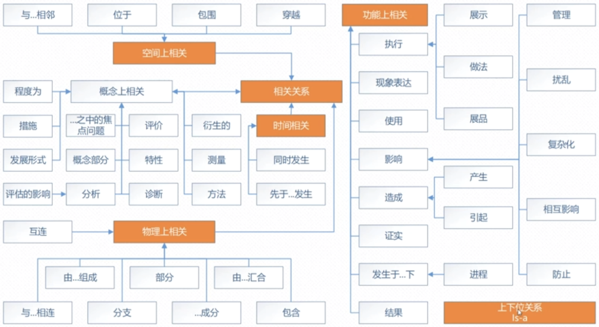
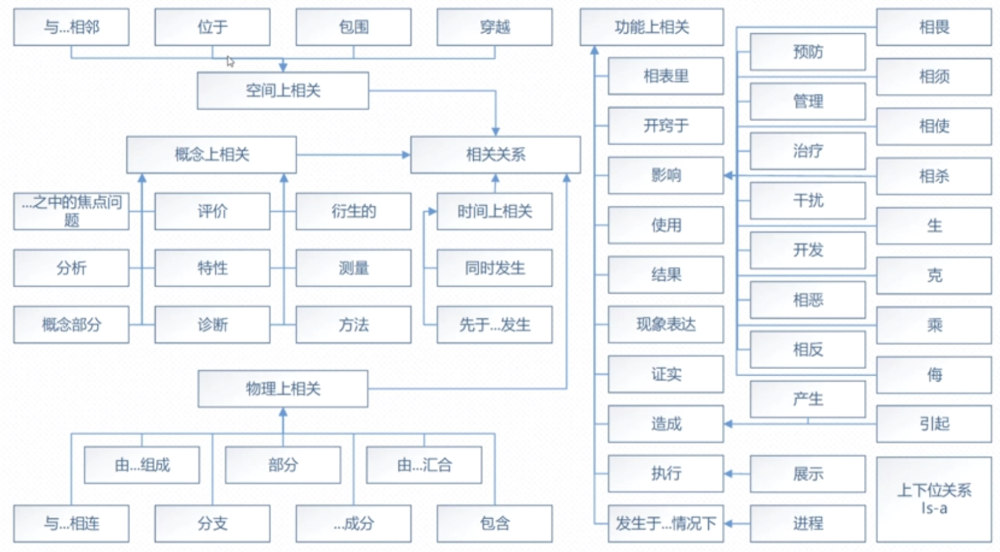
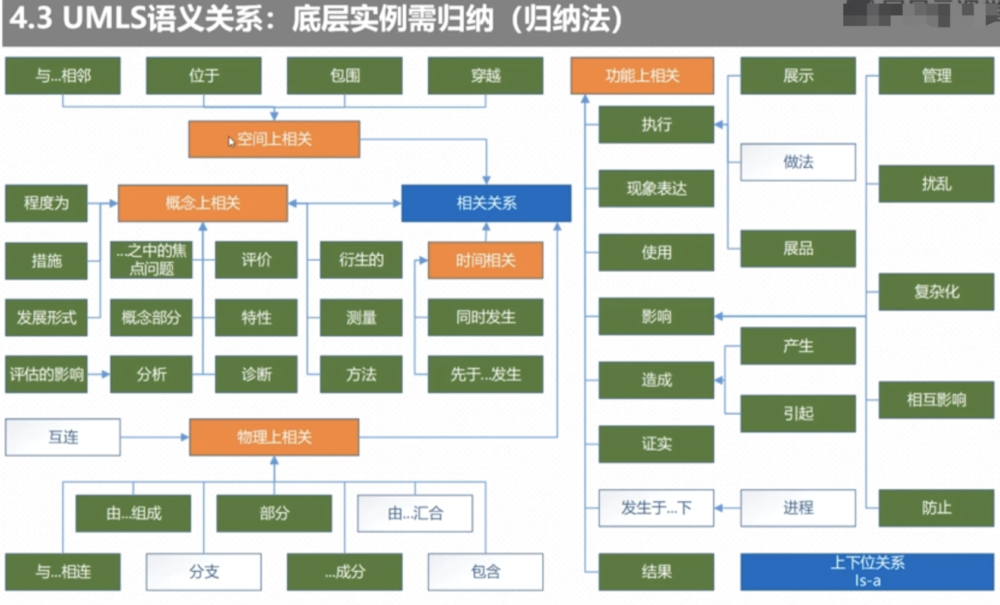
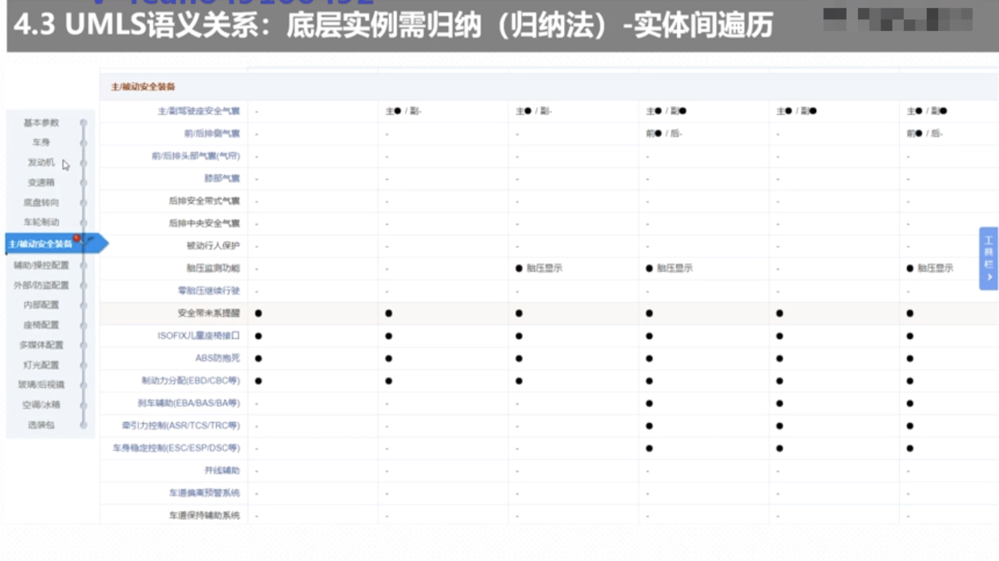

### 知识图谱语义关系的设计
口诀原则：参照与对标，适配和裁剪；归纳与总结，抽象和提炼。  

#### 1.UMLS语义关系：高层关系可复用(参照法)  
    
  这个一个通用的关系。
  语义关系分为：相关关系跟上下位关系。  
  相关关系的高层分为：空间上相关、时间上相关、物理上相关、功能上相关。同样高层关系是可以复用饿。
  就是我们的参照法，另外一个
    
 
 下面我们看下基于这些关系我们划分的UMLS下的TCMLS的语义关系

#### 2. TCMLS语义关系：高层关系可复用(参照法) 
    我们发现汽车知识图谱的关系是可以复用的：我们发现里面的上下位关系、空间上关系、功能上关系、物理上关系都是可以复用的。
    
  
#### 3. UMLS语义关系：底层示例需归纳(归纳法)  
  
  我们知道上面有上下位关系，相关关系，比如我们的时间相关，如果泄漏跟异想同时发生，那么他在时间上就是。
  底层示例需归纳的时候，我们如何进行实体归纳呢？
  第一种方式：实体间遍历--找其中的一个实体，把与之相关的所有实体去排查一遍看其之间有没有关系。抽象出来实体对象。比如：断轴与自燃，断轴与制动失灵等与之所有可能组合。
  
  
  另一个方式：处理事件，通过事件的相关我们来考量实体间的关系。如下我们通过事件归纳，把相关的关系抽取出来。
    
    
  设计在前，关系在后，设计需要一些领域专业知识。
  
