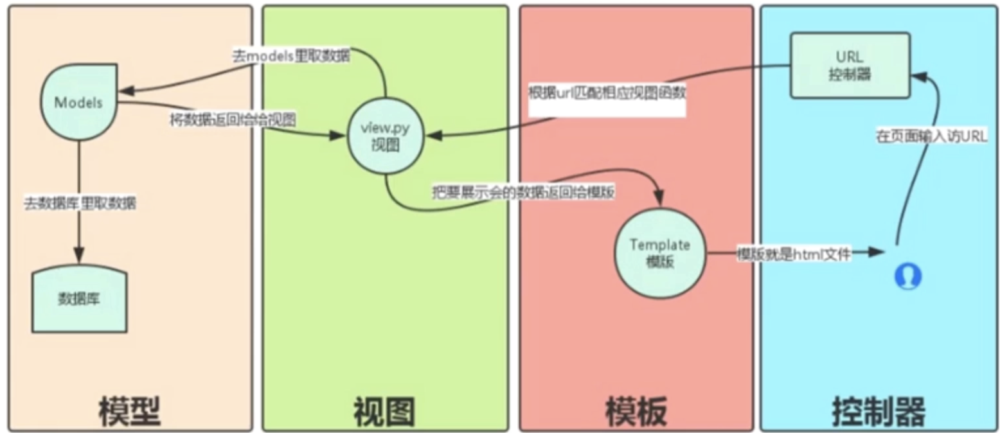
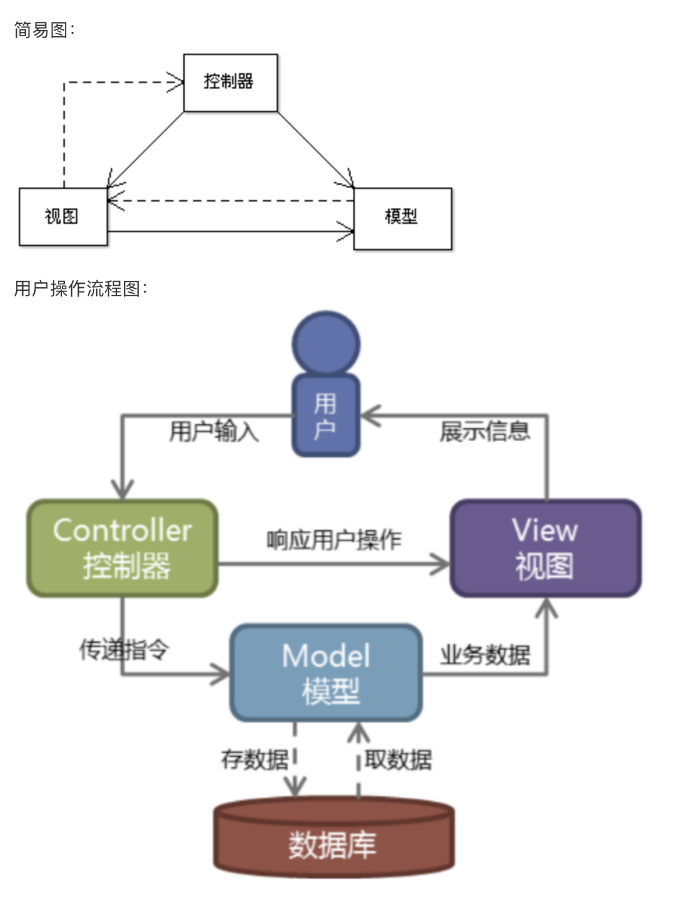
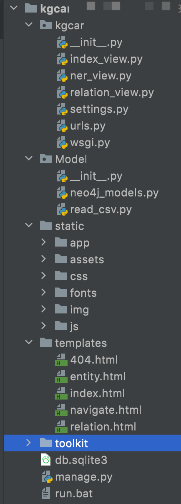

###  web前端框架设计
  我们一般基于python做web开发的话一般使用的是django的web开发框架。
  基于Django的汽车知识图谱web前端框架设计  
我们首先了解下Django：
#### Django开发框架设计
https://www.djangoproject.com/

#### Django交互流程
    
   我们的一般响应式的结果如下:
    
   基于传统的MVC的架构设计方式：
模型：跟数据库打交道的。
视图：响应web前端的交互式数据。
模版：就是前端展示给大家可以看到的内容，一般指代前端的页面。

   访问人员请求controller控制器，然后控制器解析用户的请求，获取模型数据（模型数据是从数据库中获取），然后
将模型数据返回给视图(View);视图拿到这个数据之后将数据返回给用户。  
   
##### 1、Django路由
   Django的路由规则如下所示：  
   
```renderscript
"""kgcar URL Configuration

The `urlpatterns` list routes URLs to views. For more information please see:
    https://docs.djangoproject.com/en/2.0/topics/http/urls/
Examples:
Function views
    1. Add an import:  from my_app import views
    2. Add a URL to urlpatterns:  path('', views.home, name='home')
Class-based views
    1. Add an import:  from other_app.views import Home
    2. Add a URL to urlpatterns:  path('', Home.as_view(), name='home')
Including another URLconf
    1. Import the include() function: from django.urls import include, path
    2. Add a URL to urlpatterns:  path('blog/', include('blog.urls'))
"""

from django.contrib import admin
from django.urls import path
from django.conf.urls import url


from . import index_view
from . import ner_view
from . import relation_view


urlpatterns = [
    path('admin/', admin.site.urls),
    url(r'^$', index_view.index),
    url(r'^ner-post', ner_view.ner_post),
    url(r'^search_entity', relation_view.search_entity),
    url(r'^search_relation', relation_view.search_relation),
]
```

   上面是把用户请求的url转发到对应的控制器.方法上，比如上面将不加任何后缀的请求会转发到:index_view下的index方法。

命名实体查询的请求:^search_entity-->转发到了:relation_view视图的search_entity方法。
实体识别请求:^ner-post-->转发到了：ner_view视图的ner_post方法。
关系查询的请求:^search_relation-->转发到了:relation_view视图的search_relation方法。  

其中:ner_view/relation_view/relation_view指代的是对应的python文件。  

##### 2、Django模版
   路由到对应的controller之后会返回对应的模型然后渲染的视图给模版:template。  
   我们以命名实体识别为例:

路由为:
```buildoutcfg

```


视图为:

```buildoutcfg

```

模型为:
```buildoutcfg

```

模版为：

```buildoutcfg

```

##### 3、系统目录结构
    

kgcar:是我们构建的工程
model:与数据库交互的文件
static:是我们通用的样式.
template:模版.
toolkit:我们设置的工具.

##### 4、创建项目
   使用 django-admin 来创建 HelloWorld 项目：
   
```renderscript
django-admin startproject HelloWorld
```

创建完成后我们可以查看下项目的目录结构：

```renderscript
$ cd HelloWorld/
$ tree
.
|-- HelloWorld
|   |-- __init__.py
|   |-- asgi.py
|   |-- settings.py
|   |-- urls.py
|   `-- wsgi.py
`-- manage.py
```
   
目录说明：

HelloWorld: 项目的容器。
manage.py: 一个实用的命令行工具，可让你以各种方式与该 Django 项目进行交互。
HelloWorld/__init__.py: 一个空文件，告诉 Python 该目录是一个 Python 包。
HelloWorld/asgi.py: 一个 ASGI 兼容的 Web 服务器的入口，以便运行你的项目。
HelloWorld/settings.py: 该 Django 项目的设置/配置。
HelloWorld/urls.py: 该 Django 项目的 URL 声明; 一份由 Django 驱动的网站"目录"。
HelloWorld/wsgi.py: 一个 WSGI 兼容的 Web 服务器的入口，以便运行你的项目。

接下来我们进入 HelloWorld 目录输入以下命令，启动服务器：

```renderscript
python3 manage.py runserver 0.0.0.0:8000
```


  

 
