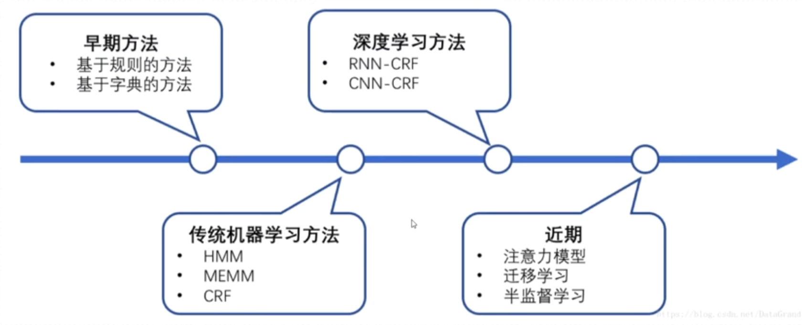
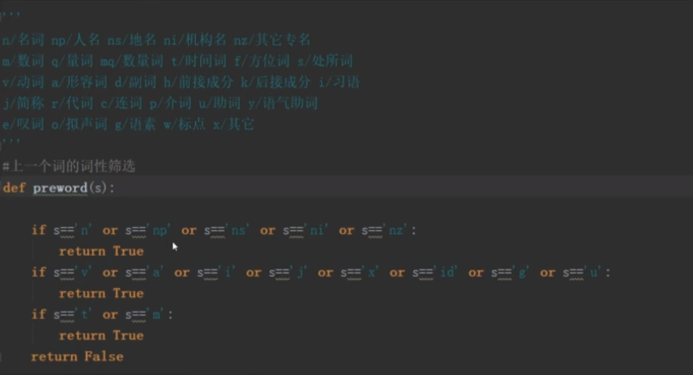
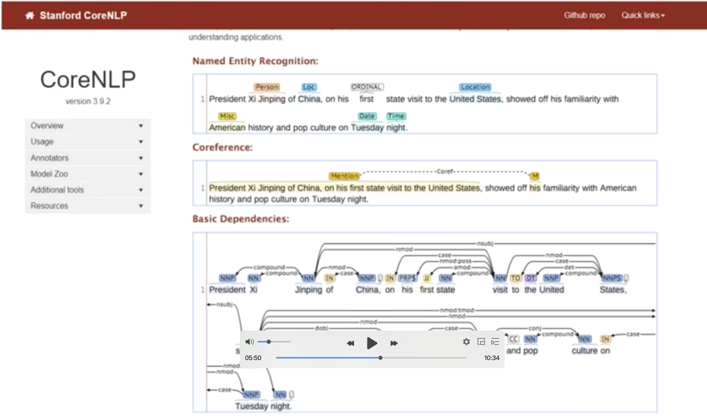
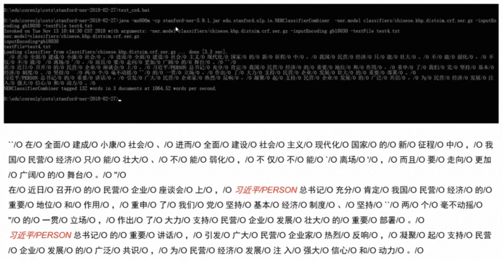

###  通用命名实体识别
  命名实体类型划分、技术方案、开源框架
#### 1、通用命名实体识别概念定义和类型划分
###### 概念定义
   命名实体识别是信息提取、问答系统、句法分析、机器翻译、面向Semantic Web的元数据标注等应用领域的重要基础工具，在自然语言处理技术走向实用化的过程中占有重要地位。

###### 类型划分
  一般来说，命名实体识别的任务就是识别出待处理文本中三大类(实体类、时间类和数字类)、七小类(人名、机构名、地名、时间、日期、货币和百分比)命名实体。   
（上面的3大类与7小类是通用行业实体识别的实体，他没有行业标签）

#### 2、通用命名实体识别方法
   
 
 上面是通用命名实体识别的方法演进：
 早期：基于规则、基于词典
 传统机器学习方法：HMM、MEMM、CRF
 深度学习方法：RNN-CRF/CNN-CRF
 近期：注意力模型、迁移学习、半监督学习
 
 目前比较成熟的是：早期的基于规则跟词典的方法；传统机器学习方法(HMM跟CRF)；后面的深度学习跟近期的方法我们不好说。  
 
##### 2.1 通用命名实体识别方法:基于词典的方法
.词性标注类说明: (清华大学的一个系统) 
n/名词 np/人名 ns/地名 ni/机构名 nz/其他专名
m/数词 q/量词 mq/数量词 t/时间词 f/方位词 s/出所词
v/动词 a/形容词 d/副词 h/前接成分 k/后接成分 i/习语  
j/简称 r/代词 c/连词 p/介词 u/助词 y/语气助词
e/叹词 o/拟声词 g/语素 w/标点 x/其他  

   判断一个词是否是命名实体对象，我们可以根据其词性来判断。
   
 
##### 2.2 通用命名实体识别方法:开源框架CoreNLP、CRF

  
  基于CRF做的图谱。CoreNLP有几个独立的组建，有分词，词性标注，有以存语法分析，然后就是他的命名实体识别。  
  
 以下是执行的方法：如下:
 
 处理的文本:text4.txt
   
 

 
 
 
 

