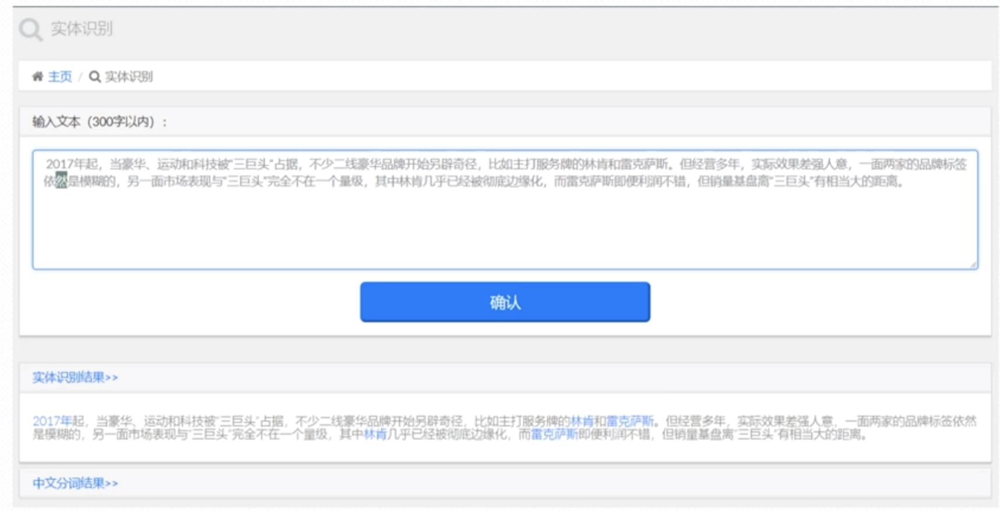
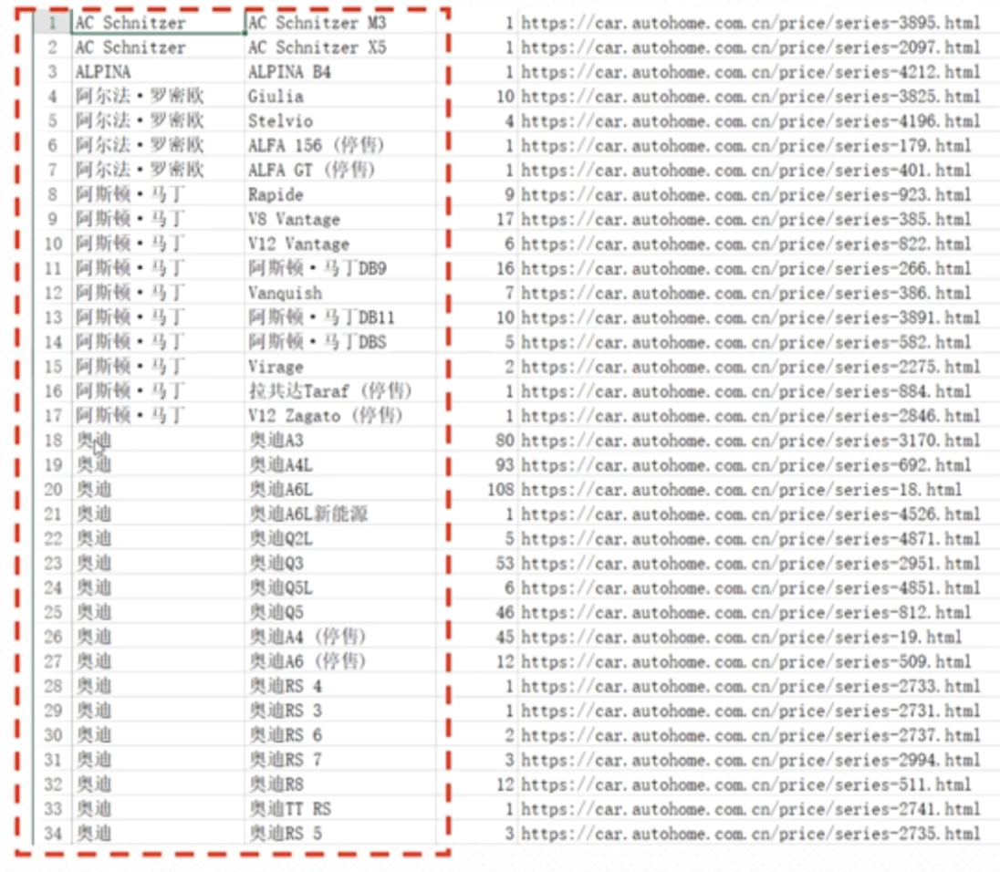
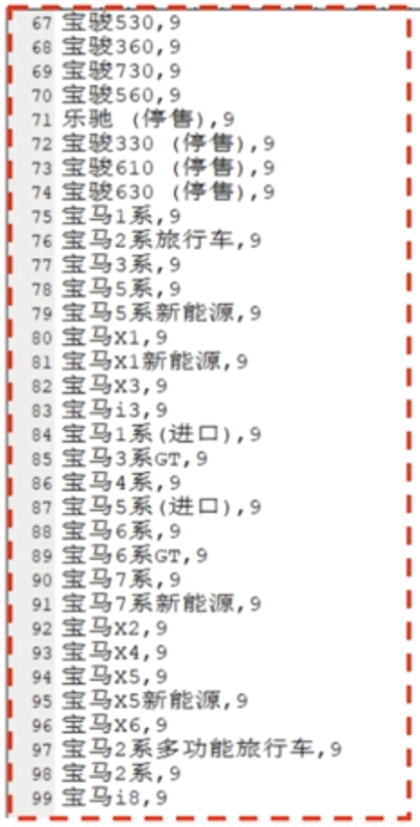

###  领域命名实体识别
  汽车领域命名实体词典设计和应用，比如上一节我们讲解的通用命名实体识别，如下：
  
  比如上面的林肯跟雷克萨斯是品牌，同时也是一个汽车厂商。这个时候我们如何将林肯跟雷克萨斯通过命名实体识别将其准确的识别出来了？
有什么样的方法来解决这么样的问题呢?
  在这个里面涉及到一个关键的点就是:汽车领域命名实体词典设计和应用。
  那么到底是如何做的呢？上面我们可以看到我们识别出了林肯跟雷克萨斯，并且我们也获取到了汽车的数据，如下:
  
  上面是我们的汽车品牌跟汽车车系。我们通过将其摘录出来 然后形成一个汽车领域的命名实体词典->然后给他一个类型编号跟类型说明:  
  
   比如我们将上面的车系，比如:宝马x1,宝马x3,宝马x4,宝马x5 它都是车系,我们给其一个编码为:9;品牌我们可以将其编码为:8 。
   
   我们对应的程序如何做呢？
   当模版层,有调用我们命名实体识别的时候(index.html):
```renderscript
 <form action="/ner-post" method="post">
    <div class="form-group">
        
        <textarea type="text" name="user_text" class="form-control" placeholder="Enter text" style="height:140px"> </textarea>
    </div>
    <div class="col-md-4"></div>
    <div class="col-md-4">
        <button type="submit" class="btn-primary btn-lg btn-block"> 确认 </button>
    </div>
    <div class="col-md-4"></div>
</form>
```  

我们的视图层的一个操作如下:
```renderscript
#中文分词:提前移除空格
key = key.strip()
TagList = thu1.cut(key, text=False)
text = ""
#命名实体识别
ner_list = get_ner(key)
#遍历输出
for pair in ner_list:
    if pair[1] == 0:
        text += pair[0]
        continue
    if tempword(pair[1]):
        text += "<a href='#'  data-original-title='" + get_ner_info(pair[1]) + "(暂无资料)'  data-placement='top' data-trigger='hover' data-content='"+get_detail_ner_info(pair[1])+"' class='popovers'>" + pair[0] + "</a>"
        continue
    
    text += "<a href='detail.html?title=" + pair[0] + "'  data-original-title='" + get_ner_info(pair[1]) + "'  data-placement='top' data-trigger='hover' data-content='"+get_detail_ner_info(pair[1])+"' class='popovers'>" + pair[0] + "</a>"

```

其会调用一个方法:get_ner(key),对应的
```renderscript
def get_ner_info(s):
    if s == 1:
        return '人物'
    if s == 2:
        return '地点'
    if s == 3:
        return '机构'
    if s == 4:
        return '数字'
    if s == 5:
        return '时间'
    if s == 6:
        return '日期'
    if s == 7:
        return '货币'
    if s == 8:
        return '汽车品牌'
    if s == 9:
        return '汽车车系'
    if s == 10:
        return '汽车车型'
    if s == 16:
        return '其它实体'
```

然后看我们的词典里面对应的是哪种数据？  


   
   
   
   
   
   


