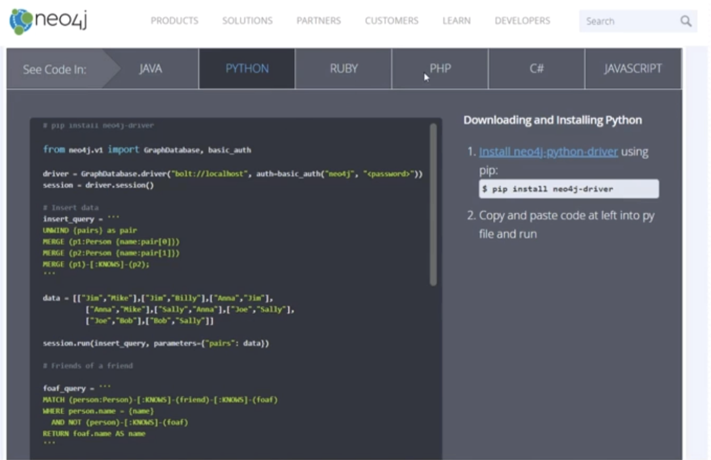
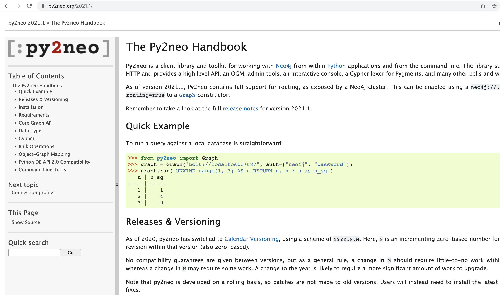
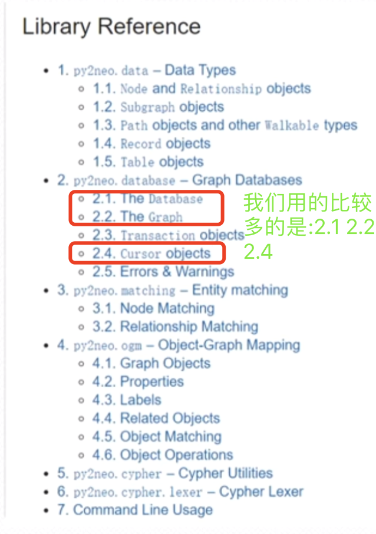
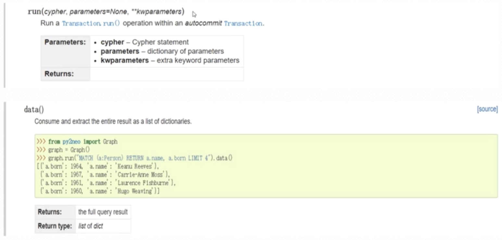
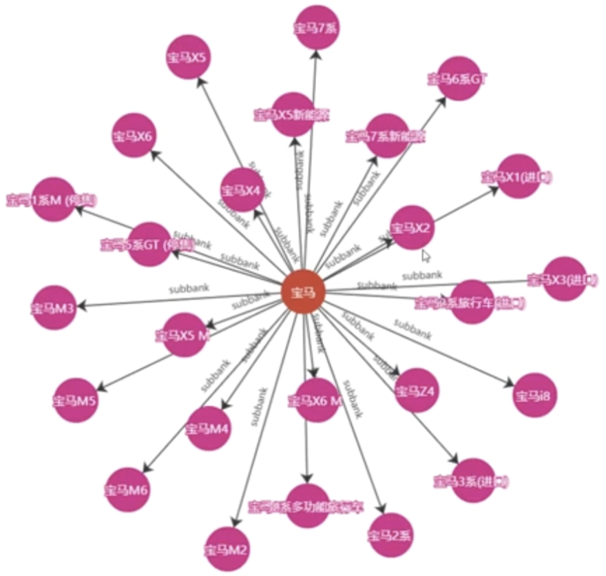

###  汽车领域实体查询
  汽车领域实体查询使用2个关键的技术:1、Neo2j开发驱动 2、Py2neo开发框架。  
  
    
  neo4j提供了很多种语言的支持:如上有很多种
  
  在neo2j的基础之上有人封装了一套非常友好的开发框架:py2neo。 我们可以基于 py2neo来基于数据库的访问。 
      
   我们用的比较多的是以下类型:
     
   
#### 1.graph

   如下函数:run就是graph模块的一个函数,其返回值是一个游标对象。返回的游标对象的data()函数可以获取到我们的
确切数据。如上所示。  
   上面的MATCH---相当于我们的select
   a----带表的是一个变量  
   
对应的python程序如下:

```renderscript
# -*- coding: utf-8 -*-
from py2neo import Graph, Node, Relationship, NodeMatcher


# 版本说明：Py2neo v4
class Neo4j_Handle():
    graph = None
    matcher = None

    def __init__(self):
        print("Neo4j Init ...")

    def connectDB(self):
        self.graph = Graph("bolt: // localhost:7687", username="neo4j", password="zhangzl")
        self.matcher = NodeMatcher(self.graph)

    # 实体查询，用于命名实体识别：品牌+车系+车型
    def matchEntityItem(self, value):
        answer = self.graph.run("MATCH (entity1) WHERE entity1.name = \"" + value + "\" RETURN entity1").data()
        return answer

    # 实体查询
    def getEntityRelationbyEntity(self, value):
        # 查询实体：不考虑实体类型，只考虑关系方向
        answer = self.graph.run(
            "MATCH (entity1) - [rel] -> (entity2)  WHERE entity1.name = \"" + value + "\" RETURN rel,entity2").data()
        if (len(answer) == 0):
            # 查询实体：不考虑关系方向
            answer = self.graph.run(
                "MATCH (entity1) - [rel] - (entity2)  WHERE entity1.name = \"" + value + " \" RETURN rel,entity2").data()
        print(answer)
        return answer

    # 关系查询:实体1
    def findRelationByEntity1(self, entity1):
        # 基于品牌查询
        answer = self.graph.run("MATCH (n1:Bank {name:\"" + entity1 + "\"})- [rel] -> (n2) RETURN n1,rel,n2").data()
        # 基于车系查询，注意此处额外的空格
        if (len(answer) == 0):
            answer = self.graph.run(
                "MATCH (n1:Serise {name:\"" + entity1 + " \"})- [rel] - (n2) RETURN n1,rel,n2").data()
        return answer

    # 关系查询：实体2
    def findRelationByEntity2(self, entity1):
        # 基于品牌
        answer = self.graph.run("MATCH (n1)<- [rel] - (n2:Bank {name:\"" + entity1 + "\"}) RETURN n1,rel,n2").data()
        if (len(answer) == 0):
            # 基于车系
            answer = self.graph.run(
                "MATCH (n1) - [rel] - (n2:Serise {name:\"" + entity1 + " \"}) RETURN n1,rel,n2").data()
        return answer

    # 关系查询：实体1+关系
    def findOtherEntities(self, entity, relation):
        answer = self.graph.run(
            "MATCH (n1:Bank {name:\"" + entity + "\"})- [rel:Subtype {type:\"" + relation + "\"}] -> (n2) RETURN n1,rel,n2").data()
        return answer

    # 关系查询：关系+实体2
    def findOtherEntities2(self, entity, relation):
        print("findOtherEntities2==")
        print(entity, relation)
        answer = self.graph.run(
            "MATCH (n1)- [rel:RELATION {type:\"" + relation + "\"}] -> (n2:Bank {name:\"" + entity + "\"}) RETURN n1,rel,n2").data()
        if (len(answer) == 0):
            answer = self.graph.run(
                "MATCH (n1)- [rel:RELATION {type:\"" + relation + "\"}] -> (n2:Serise {name:\"" + entity + " \"}) RETURN n1,rel,n2").data()
        return answer

    # 关系查询：实体1+实体2(注意Entity2的空格）
    def findRelationByEntities(self, entity1, entity2):
        # 品牌 + 品牌
        answer = self.graph.run(
            "MATCH (n1:Bank {name:\"" + entity1 + "\"})- [rel] -> (n2:Bank{name:\"" + entity2 + " \"}) RETURN n1,rel,n2").data()
        if (len(answer) == 0):
            # 品牌 + 系列
            answer = self.graph.run(
                "MATCH (n1:Bank {name:\"" + entity1 + "\"})- [rel] -> (n2:Serise{name:\"" + entity2 + " \"}) RETURN n1,rel,n2").data()
        if (len(answer) == 0):
            # 系列 + 品牌
            answer = self.graph.run(
                "MATCH (n1:Serise {name:\"" + entity1 + "\"})- [rel] -> (n2:Bank{name:\"" + entity2 + " \"}) RETURN n1,rel,n2").data()
        if (len(answer) == 0):
            # 系列 + 系列
            answer = self.graph.run(
                "MATCH (n1:Serise {name:\"" + entity1 + "\"})- [rel] -> (n2:Serise{name:\"" + entity2 + " \"}) RETURN n1,rel,n2").data()
        return answer

    # 查询数据库中是否有对应的实体-关系匹配
    def findEntityRelation(self, entity1, relation, entity2):
        answer = self.graph.run(
            "MATCH (n1:Bank {name:\"" + entity1 + "\"})- [rel:subbank {type:\"" + relation + "\"}] -> (n2:Bank{name:\"" + entity2 + "\"}) RETURN n1,rel,n2").data()
        if (len(answer) == 0):
            answer = self.graph.run(
                "MATCH (n1:Bank {name:\"" + entity1 + "\"})- [rel:subbank {type:\"" + relation + "\"}] -> (n2:Serise{name:\"" + entity2 + "\"}) RETURN n1,rel,n2").data()
        if (len(answer) == 0):
            answer = self.graph.run(
                "MATCH (n1:Serise {name:\"" + entity1 + "\"})- [rel:subbank {type:\"" + relation + "\"}] -> (n2:Bank{name:\"" + entity2 + "\"}) RETURN n1,rel,n2").data()
        if (len(answer) == 0):
            answer = self.graph.run(
                "MATCH (n1:Serise {name:\"" + entity1 + "\"})- [rel:subbank {type:\"" + relation + "\"}] -> (n2:Serise{name:\"" + entity2 + "\"}) RETURN n1,rel,n2").data()

        return answer
```

然后我们实现的效果为(我们输入实体:"宝马"之后的效果):  
  

 

 
   
   
   
   
  
  
