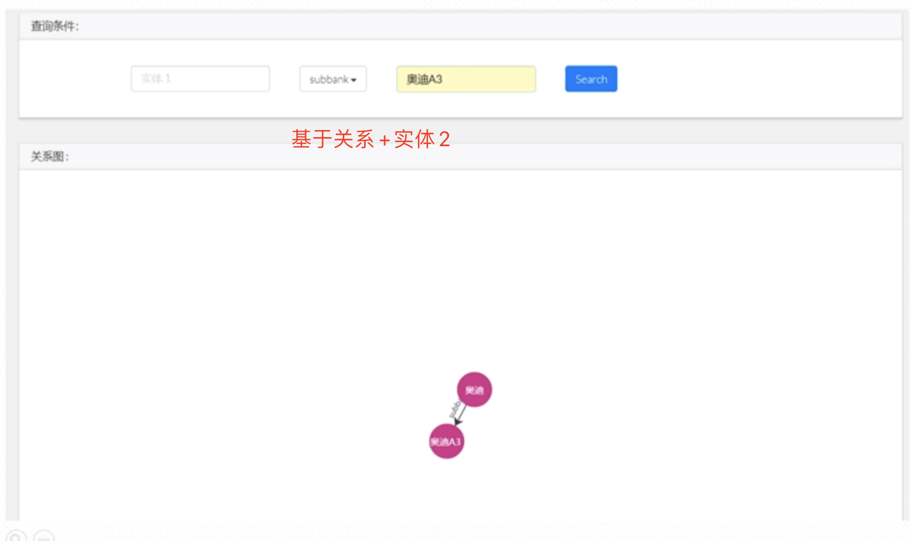

###  汽车领域关系查询
  汽车领域关系查询这一节我们主要涉及到:py2neo开发框架、实体关系词查询。具体的效果如下图:
    
  关系查询有多种情况:
  情况一:输入一个实体，然后查询出这个实体的所有关系。  
  情况二:输入一个实体，然后选择一个关系类型，然后做一个查询。  
    
  情况三:输入一个实体，然后选择关系类型之后，再次选择一个实体进行查询。  
  
   
 
   
#### 代码实现
##### 1、关系查询，只基于实体1的。  

```renderscript
 # 关系查询:实体1
    def findRelationByEntity1(self, entity1):
        # 基于品牌查询
        answer = self.graph.run("MATCH (n1:Bank {name:\"" + entity1 + "\"})- [rel] -> (n2) RETURN n1,rel,n2").data()
        # 基于车系查询，注意此处额外的空格
        if len(answer) == 0:
            answer = self.graph.run(
                "MATCH (n1:Serise {name:\"" + entity1 + " \"})- [rel] - (n2) RETURN n1,rel,n2").data()
        return answer
```

其对应效果如下:
  

##### 2、基于实体2
   基于实体2的查询,我们得到

```renderscript
    # 关系查询：实体2
    def findRelationByEntity2(self, entity1):
        # 基于品牌
        answer = self.graph.run("MATCH (n1)<- [rel] - (n2:Bank {name:\"" + entity1 + "\"}) RETURN n1,rel,n2").data()
        if (len(answer) == 0):
            # 基于车系
            answer = self.graph.run(
                "MATCH (n1) - [rel] - (n2:Serise {name:\"" + entity1 + " \"}) RETURN n1,rel,n2").data()
        return answer
```
效果如下:
 


##### 3、汽车实体关系查询:基于实体1+关系
   基于实体:宝马 加上关系:subbank  

代码如下:

```renderscript
 # 关系查询：实体1+关系
    def findOtherEntities(self, entity, relation):
        answer = self.graph.run(
            "MATCH (n1:Bank {name:\"" + entity + "\"})- [rel:Subtype {type:\"" + relation + "\"}] -> (n2) RETURN n1,rel,n2").data()
        return answer
```

实体关系如下:
 


##### 3、汽车实体关系查询:基于关系+实体2  
   基于关系:subbank  关系:奥迪A3  
代码如下:
```renderscript
 # 关系查询：关系+实体2
    def findOtherEntities2(self, entity, relation):
        print("findOtherEntities2==")
        print(entity, relation)
        answer = self.graph.run(
            "MATCH (n1)- [rel:RELATION {type:\"" + relation + "\"}] -> (n2:Bank {name:\"" + entity + "\"}) RETURN n1,rel,n2").data()
        if (len(answer) == 0):
            answer = self.graph.run(
                "MATCH (n1)- [rel:RELATION {type:\"" + relation + "\"}] -> (n2:Serise {name:\"" + entity + " \"}) RETURN n1,rel,n2").data()
        return answer
```

实体关系效果如下:
 

##### 4、汽车实体关系查询:实体1 + 实体2  
   实体1:汽车品牌    实体2:汽车车系
代码如下:

```renderscript
# 关系查询：实体1+实体2(注意Entity2的空格）
    def findRelationByEntities(self, entity1, entity2):
        # 品牌 + 品牌
        answer = self.graph.run(
            "MATCH (n1:Bank {name:\"" + entity1 + "\"})- [rel] -> (n2:Bank{name:\"" + entity2 + " \"}) RETURN n1,rel,n2").data()
        if (len(answer) == 0):
            # 品牌 + 系列
            answer = self.graph.run(
                "MATCH (n1:Bank {name:\"" + entity1 + "\"})- [rel] -> (n2:Serise{name:\"" + entity2 + " \"}) RETURN n1,rel,n2").data()
        if (len(answer) == 0):
            # 系列 + 品牌
            answer = self.graph.run(
                "MATCH (n1:Serise {name:\"" + entity1 + "\"})- [rel] -> (n2:Bank{name:\"" + entity2 + " \"}) RETURN n1,rel,n2").data()
        if (len(answer) == 0):
            # 系列 + 系列
            answer = self.graph.run(
                "MATCH (n1:Serise {name:\"" + entity1 + "\"})- [rel] -> (n2:Serise{name:\"" + entity2 + " \"}) RETURN n1,rel,n2").data()
        return answer
```

实体关系效果如下:
 


