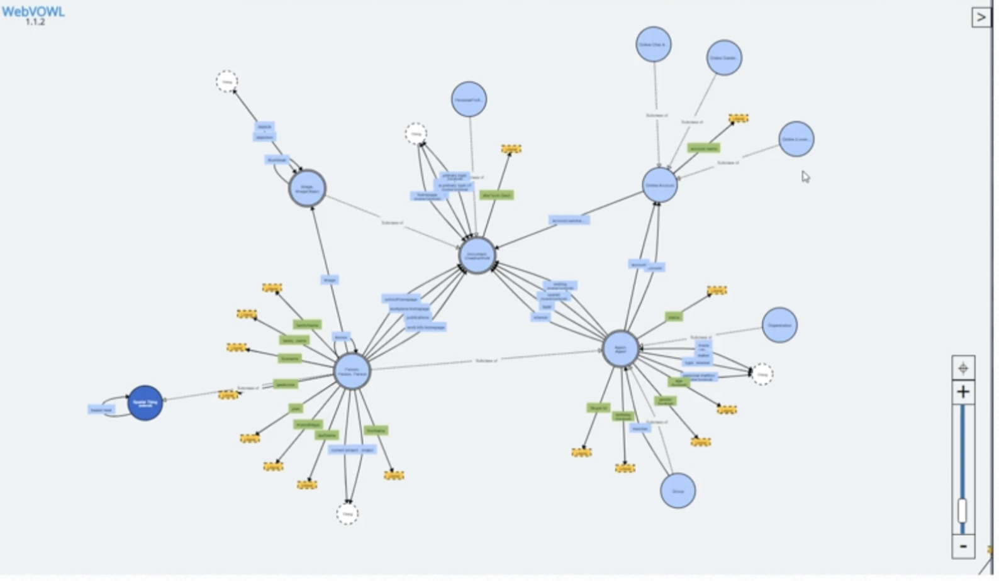
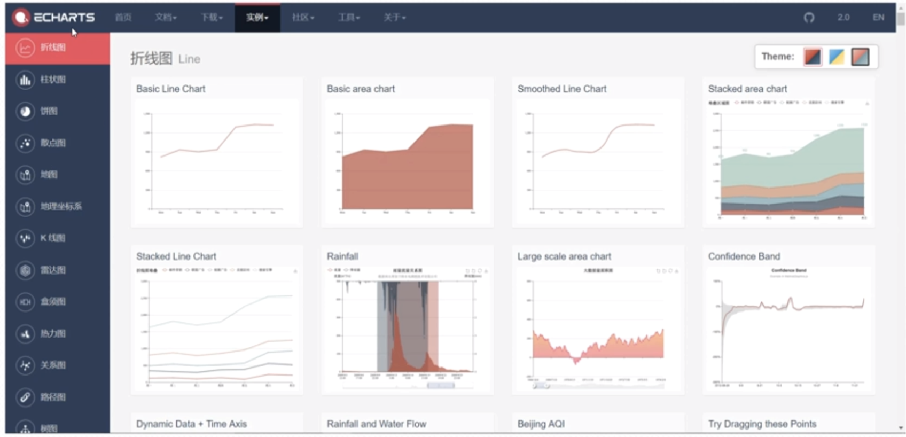

###  知识图谱数据可视化
  这一节我们主要讲解下:知识图谱的构成是:节点+关系；我们如何将节点跟关系进行可视化的展示呢？基于这一节目，我们可以看以下
我们主要讲解下:数据可视化方案、Echarts图数据可视化。


#### 数据可视化方案
##### 数据可视化方案一:D3
  我们一般可用的就是我们所说的D3:
 
  对应的展示效果如下(本地可视化的example):
   

  这个做的比较粗糙一些。
##### 数据可视化方案二:Echarts
  Echarts是国内开源的
  
详细内容:
  

对应的代码如下:
```renderscript
<script type="text/javascript">
        // 基于查询结果：初始化Data和Links列表，用于Echarts可视化输出
        var ctx = [ {{ ctx|safe }} ] ;
        //{entity2,rel}
        var entityRelation = [ {{ entityRelation|safe }} ] ;
        var data = [] ;
        var links = [] ;
        if(ctx.length == 0){
            var node = {} ;
            var url = decodeURI(location.search) ;
            var str = "";
            if(url.indexOf("?") != -1){
                str = url.split("=")[1]
            }
            //实体1：待查询的对象
            node['name'] = str;
            node['draggable'] = true ;
            var id = 0; 
            node['id'] = id.toString() ;
            data.push(node) ;

            //实体2：查询并转储到data中，取二者较小的值
            var maxDisPlayNode = 25 ;
            for( var i = 0 ;i < Math.min(maxDisPlayNode,entityRelation[0].length) ; i++ ){
                node = {} ;
                node['name'] = entityRelation[0][i]['entity2']['name'] ;
                node['draggable'] = true ;   //是否允许拖拽
                //是否URL：区分类型
                if('url' in entityRelation[0][i]['entity2']){
                    node['category'] = 1 ;
                }
                else{
                    node['category'] = 2 ;
                }
                id = i + 1
                node['id'] = id.toString();
                var flag = 1 ;
                relationTarget = id.toString() ;
                for(var j = 0 ; j<data.length ;j++){
                    if(data[j]['name'] === node['name']){
                        flag = 0 ;
                        relationTarget = data[j]['id']  ;
                        break ;
                    }
                }
                relation = {}
                relation['source'] = 0 ;
                relation['target'] = relationTarget ;
                relation['category'] = 0 ;               

                if(flag === 1){
                    data.push(node) ;
                    relation['value'] = entityRelation[0][i]['rel']['type'] ;
                    relation['symbolSize'] = 10
                    links.push(relation) ;
                }
                else{
                    maxDisPlayNode += 1 ;
                    for(var j = 0; j<links.length ;j++){
                        if(links[j]['target'] === relationTarget){
                            links[j]['value'] = links[j]['value']+" | "+entityRelation[0][i]['rel']['type'] 
                            break ;
                        }
                    }

                }
            }
            //基于表格的展示++
            tableData = []
            for (var i = 0 ; i < entityRelation[0].length ; i++){
                relationData = {} ;
                relationData['entity1'] = str ;
                relationData['relation'] = entityRelation[0][i]['rel']['type'] ;
                relationData['entity2'] = entityRelation[0][i]['entity2']['name'] ;
                tableData.push(relationData) ;
            }
            jQuery(function(){
                $('.table').footable({
                "columns": [{"name":"entity1",title:"Entity1"} ,
                          {"name":"relation",title:"Relation"},
                          {"name":"entity2",title:"Entity2"}],
                "rows": tableData
                });
            });
            //基于表格的展示--

        }
        // 基于准备好的数据：Data和Links，设置Echarts参数
        var myChart = echarts.init(document.getElementById('graph'));
        option = {
            title: {
                text: ''
            },                //标题
            tooltip: {},                           //提示框配置
            animationDurationUpdate: 1500,
            animationEasingUpdate: 'quinticInOut',
            label: {
                normal: {
                    show: true,
                    textStyle: {
                        fontSize: 12
                    },
                }
            },                          //节点上的标签
            legend: {
                x: "center",
                show: false
            },
            series: [
                {
                    type: 'graph',                //系列：
                    layout: 'force',
                    symbolSize: 45,
                    focusNodeAdjacency: true,
                    roam: true,
                    edgeSymbol: ['none', 'arrow'],
                    categories: [{
                        name: 'Bank',
                        itemStyle: {
                            normal: {
                                color: "#009800",
                            }
                        }
                    }, {
                        name: 'Serise',
                        itemStyle: {
                            normal: {
                                color: "#4592FF",
                            }
                        }
                    }, {
                        name: 'Instance',
                        itemStyle: {
                            normal: {
                                color: "#C71585",
                            }
                        }
                    }],
                    label: {
                        normal: {
                            show: true,
                            textStyle: {
                                fontSize: 12,
                            },
                        }
                    },               //节点标签样式
                    force: {
                        repulsion: 1000
                    },
                    edgeSymbolSize: [4, 50],
                    edgeLabel: {
                        normal: {
                            show: true,
                            textStyle: {
                                fontSize: 10
                            },
                            formatter: "{c}"
                        }
                    },           //边标签样式
                    data: data,                 //节点
                    links: links,               //节点间的关系
                    lineStyle: {
                        normal: {
                            opacity: 0.9,
                            width: 1.3,
                            curveness: 0,
                            color:"#262626"
                        }
                    }            // 连接线的风格
                }
            ]
        };
        myChart.setOption(option);
</script>
```  
